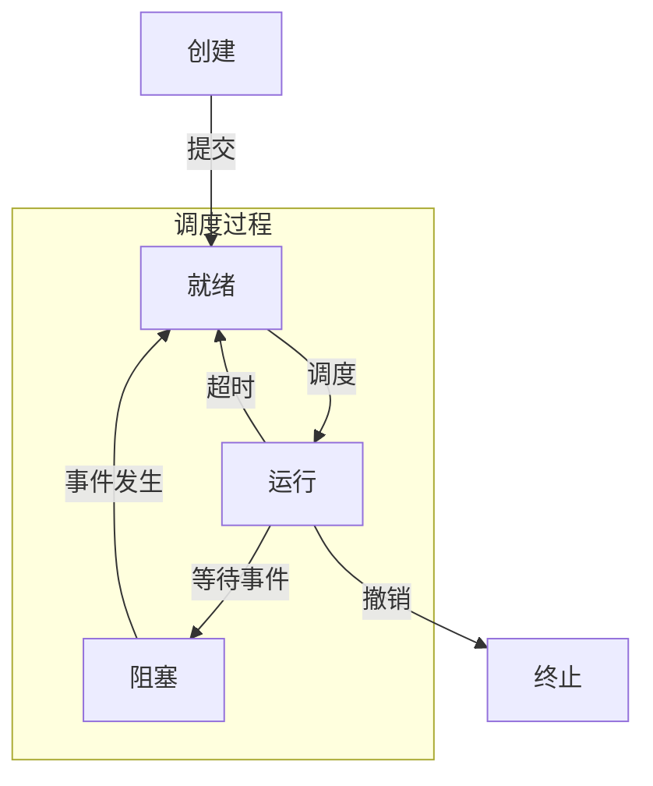

${toc}

# 1 操作系统引论

## 1.1.2 操作系统的作用

1. 用户与计算机之间的接口
    - 也可以说是"向上层提供方便易用的服务"
2. 系统资源的管理者
3. 对计算机资源的抽象
    - 也可以说是"最接近硬件的一层软件"

## 1.2.4 分时系统

> 操作性较好

### 1.2.4.1 引入原因

由于以下需求

- 人机交互

    能够方便地进行独占全机并直接控制，方便进行修改

- 共享主机
    多个用户希望独占全机

### 1.2.4.2 关键问题

1. 及时接收

    比如配置多路卡，实现分时多路复用，不停高速扫描所有终端，终端还要配置缓冲区

2. 及时处理

    用户能及时对自己的作业进行控制运行，采用以下方案

    - 作业直接进入内存
    - 轮转运行，每个任务占用一个时间片(如30ms)

### 1.2.4.3 特征

1. 多路性

    允许多个用户共享一台计算机，提高资源利用率降低费用

2. 独立性

    每个用户互不干扰

3. 及时性

    用户请求在很短时间内响应

4. 交互性

    用户通过终端与系统进行广泛的人机对话，可以请求系统提供多方面的服务

## 1.2.5 实时系统

> 实时性较好

- 将时间作为关键参数，它必须对所接收的某些信号做出“及时”或“实时”的反应

- 与分时系统不同的是需要在规定的时间内完成特定的任务，否则可能会导致系统故障或严重后果

### 1.2.5.2 任务类型

1. 周期性和非周期性
    - 按指定周期循环执行
    - 反之，非周期性实时任务无明显的周期性，但都必须联系着一个截止时间(开始\/完成截止时间)
2. **硬实时和软实时**
    - 硬实时: 系统必须满足任务对截止时间的要求
    - 软实时: 也联系着一个截止时间，但并不严格

## 1.3 OS基本特征

1. **并发**
    - 并行是两个或多个事件在**同一时刻**发生
    - 并发是指在**一段时间内**宏观上有多个程序在同时运行
2. **共享**
    - 互斥共享
    - 同时共享
3. 虚拟
    - 时分复用: 令某设备在为一个用户服务的空闲时间转去为其他用户服务
    - 空分复用: 例:利用存储器的空闲空间来存放其他程序以提高内存的利用率
4. 异步
    - 进程的执行通常不可能“一气呵成”，而是会以“停停走走”的方式运行

## 1.4.2 操作系统内核

### 1.4.2.1 支撑功能

- 中断处理
- 时钟管理
- 原语操作

### 1.4.2.2 资源管理

- 进程管理
- 存储器管理
- 设备管理

## 1.5 操作系统的主要功能(四大管理功能)

### 1.5.1 处理机管理功能

1. 进程控制
2. 进程同步
3. 进程通信
4. 调度

### 1.5.2 存储器管理功能

1. 内存分配和回收
2. 内存保护
3. 地址映射
4. 内存扩充

### 1.5.4 文件管理功能

1. 文件存储空间管理
2. 目录管理
3. 文件的读 / 写管理和保护

### 1.5.5 接口管理功能(设备管理)

1. 用户接口
2. 程序接口

## 1.6 操作系统的结构

1. 简单结构
2. 模块化结构
3. 分层式结构
4. 微内核结构
5. 外核结构

# 2 进程的描述与控制

## 2.1.1 前趋图

P40 自己看课本

## 2.2 进程的描述

> 进程是动态的，程序是静态的

**进程定义**: "进程是程序的**执行过程**，是系统进行**资源分配和调度**的一个**独立单位**"

组成:

- PCB: 进程存在的**唯一标志**
- 程序段
- 数据段

### 2.2.2 进程的基本状态和转换

1. 创建状态: 正在被创建
2. **就绪**: 准备好执行的状态
3. **执行**: 其程序“正在执行”这一状态
4. **阻塞**: 在执行的进程由于发生某事件（如I/O请求、申请缓冲区失败等）而暂时无法继续执行(事件未到来)
    - 阻塞 -> 就绪: 等待事件的到来
5. 结束状态

转换

### 2.2.4 进程管理中的数据结构(PCB)

#### 2.2.4.2 作用

- 作为独立运行基本单位的标志
- 实现间断性运行方式
- 提供进程**管理**所需要的信息
- 提供进程**调度**所需要的信息
- 实现与其他进程的同步与通信

#### 2.2.4.3 包含的信息

1. 进程标识符: 外部(方便访问)或内部
2. 处理机状态: 寄存器信息等
3. 进程调度信息: 进程状态，进程优先级，CPU时间，事件(阻塞原因)
4. 进程控制信息: 程序和数据地址，资源清单等

#### 2.2.4.4 PCB组织方式

1. 线性: 将PCB全部组织在一张线性表中
2. 链接: 将相同状态的PCB分别链接成一个队列
3. 索引: 根据进程状态建立多张索引表，表记录内存中PCB起始地址

## 2.4.2 消息传递通信的实现方式

#### 2.4.2.1 **直接**通信

- 对称寻址

    `send(receiver, message)`：发送一个消息给接收进程。

    `receive(sender, message)`：接收发送进程发来的消息。

    一但改变进程名称，就需要检查所有其他进程的定义

- 非对称

    通过源进程的参数来完成通信，但发送进程仍需命名接收进程

    `send(P, message)`：发送一个消息给进程P。

    `receive(id, message)`：接收来自任何进程的消息，id变量可设置为进行通信的发送方进程id或其名字。

#### 2.4.2.2 **间接**通信(信箱通信)

进程间通信通过某种中间实体(如共享数据结构)实现，实体建立在随机存储器的共享缓冲区上

- 信箱结构分为信箱头(存放描述信息)和信箱体(存放消息)
- 通信原语包括
    1. 信箱创建和撤销
    2. 消息发送接收
        - `send(mailbox, message)`：将一个消息发送到指定信箱。
        - `receive(mailbox, message)`：从指定信箱中接收一个消息。
- 信箱类型有
  - 私用: 用户进程创建，进程的一部分
  - 公用: 由OS创建，供给系统中的所有核准进程使用
  - 共享：由某进程创建，须指明它是可共享的，同时须指出共享进程（用户）的名字

## 2.5 线程

程序执行最小单位(调度基本单位)

P63
