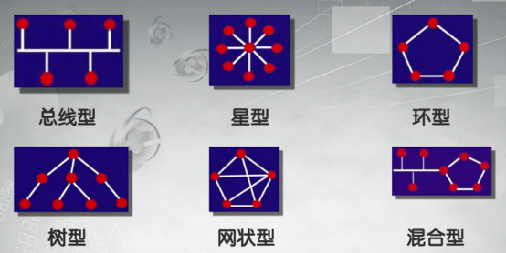
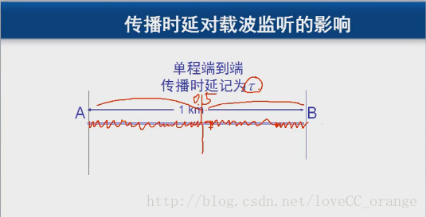
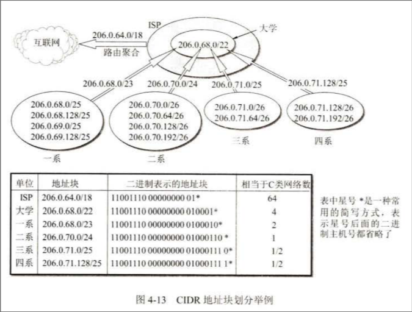
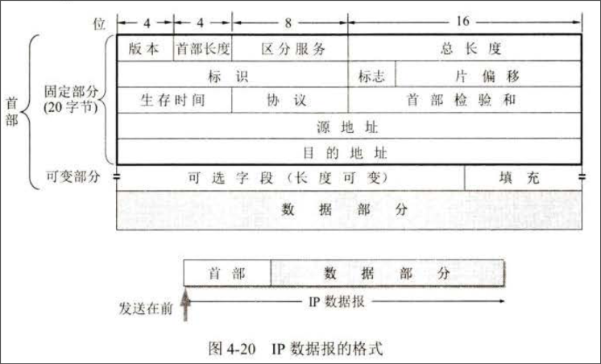
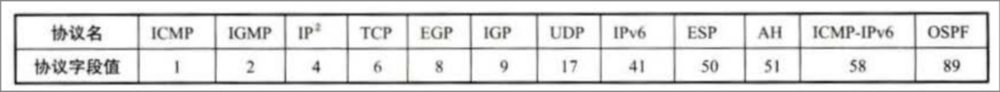
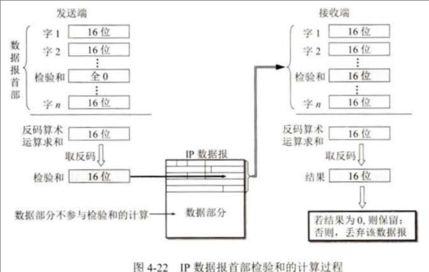
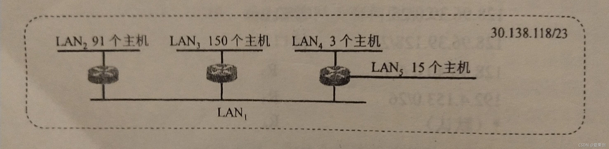
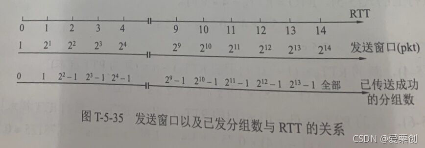

${toc}

# 1 计算机网络概述

## 计算机网络概念

### 定义

将具有**独立功能**的**多台计算机**通过**通信线路连接**，实现**资源共享**和信息传递的计算机系统

### 组成

- 终端系统\/资源子网: 提供共享的软件资源和硬件资源(如视频，音频)
- 通信子网: 提供信息交换的网络节点和通信线路(按网线理解)

### 网络类型

#### 按拓扑结构

- 星型
- 树型
- 总线型
- 环型
- 网状型

#### 按范围分类

- 局域网 LAN
  - 小区，家中
- 城域网 MAN
  - 城市
- 广域网 WAN
  - 国家，省之间
- 个人区域网 PAN
  - 服务于个人

#### 按照传输方式

- 有线
  - IEEE802.3
  - IEEE802.11
- 无线
  - 无线局域网WLAN
  - 无线个域网WPAN

## 计算机网络体系结构

### 传输方式

#### 传输方式

1. 按传输方向分
    - 单工: 只能单方向传输
    - 双工: 在同一时间，先路上只允许一个方向的数据通过
    - 全双工: 双方能够同时进行数据通信
2. 按传输对象分
    - 单播: 1对1
    - 多播: 1对多
    - 广播: 1对all

#### 数据交换

1. 电路交换
    - 整个报文从头到尾连续传输，占用整条线路
2. 报文交换
    - 不会占用整个信道，整个报文先传送到相邻节点，全部存储下来查找换发表，再转发到下一个结点
3. 分组交换
    - 将数据包分组，之后传送到相邻结点，再查找转发表转发(分组传输)

#### 通信协议和体系结构

##### 网络协议三要素

- 语义
  - 控制信息每个部分的意义，规定了需要发出何种控制信息，以及完成的动作与做出什么样的响应。
- 语法
  - 用来规定信息格式，数据及控制信息的格式、编码及信号电平等
- 时序
  - 时序是对事件发生顺序的详细说明(也可称为“同步”)

语义表示要做什么，语法表示要怎么做，时序表示做的顺序。

##### OSI参考模型

1. 应用层
    - 提供网络服务和应用程序接口（如HTTP、FTP、SMTP）
2. 表示层
    - 处理数据格式和加密（如数据压缩、加密）
3. 会话层
    - 管理会话和连接（如建立、维护、终止会话）
4. 传输层
    - 提供端到端的通信和数据完整性（如TCP、UDP）
5. 网络层
    - 单位 分组，负责数据包的路由选择和转发（如IP地址、路由器）
6. 数据链路层
    - 单位 帧，负责节点之间的数据传输和错误检测（如MAC地址、以太网）
7. 物理层
    - 单位bit，处理物理传输介质（如电缆、光纤）和信号传输

##### TCP/IP参考模型

1. 应用层
    - 应用层
    - 表示层
    - 会话层
2. 传输层
3. 网际层
    - 网络层
4. 网络接口层
    - 数据链路层
    - 物理层

## 习题

1. **试从多个方面比较电路交换、报文交换和分组交换的主要优缺点**

    - 电路交换
        - 特点
            - 通信有三阶段：建立链接、通信、释放连接，**通信过程始终占用物理信道**
        - 优点
            - 静态分配传输带宽，建立连接后通信双方所需传输带宽不会再变
            - 双方通信不收其他用户影响，占用通信资源时间不受限制
        - 缺点
            - 通信线路利用率较低
            - 整个链接中只要有一条链路或交换机出现故障就会引发通信中断
    - 分组交换
        - 特点
            - 以**报文分组**作为传输单位，采用**存储转发**技术
        - 优点
            - 无连接建立释放截断，传送数据迅速
            - 动态分配带宽，合理运用各链路传输带宽
            - 采用分布式路由选择协议，某个节点或链路出现故障分组传送路由可以动态改变，继续传输数据
        - 缺点
            - 路由器存储转发需排队，造成时延
            - 动态分配传输带宽，各段链路带宽不同，当网络某处通信量突然增大，可能在网络中某处产生拥塞，延长数据传输时间
            - 分组必须携带控制信息，产生额外开销，且需要专门的管理和控制机制
    - 报文交换
        - 特点
            - 以**整个报文**为传输单位，采用**存储转发**技术
        - 优点
            - 省去分组与重装报文的过程
        - 缺点
            - 灵活性不如分组交换，且时延较大

2. **计算机网络有哪些常用的性能指标？**

    - 速率
        - 数据的传送速率
    - 带宽
        - 单位时间内从网络中一点到另一点能通过的最高数据率
    - 吞吐量
        - 单位时间内通过某个网络的数据量
    - 时延
        - 数据从网络一端到另一端的时间
    - 时延带宽积
        - 传播时延和带宽的乘积
    - 往返时间RTT
        - 发送数据到接受确认的时间
    - 利用率
        - 信道利用率: 信道有百分之几的时间被利用
        - 网络利用率: 全网络信道利用率的加权平均值

3. **假设信号在媒体上的传播速度为2.3×10^8m/s.媒体长度L分别为：**

    1. **10cm（网络接口卡）**
    2. **100m（局域网）**
    3. **100km（城域网）**
    4. **5000km（广域网）**

    **试计算出当数据率为1Mb/s和10Gb/s时在以上媒体中正在传播的比特数。**

    媒体长度为信道中数据的长度，计算传播时延(根据数据长度和传播速度计算已经传播了多长时间)，和数据率相乘得到正在传播的比特数

    解:

    1. 传播时延: $0.1\div(2.3×10^8)=4.35 \times 10^{-10}$ bits

        1Mb/s: $4.35 \times 10^{-10} \times 10^6=4.35 \times 10^{-4}$ bits

        1Gb/s: $4.35 \times 10 * 10^{-10} \times 10^9=4.35$ bits

    2. 传播时延: 传播时延: $100\div(2.3×10^8)=4.35 \times 10^{-7}$ bits

        1Mb/s: $4.35 \times 10^{-7} \times 10^6=0.435$ bits

        1Gb/s: $4.35 \times 10 * 10^{-7} \times 10^9=4.35 \times 10^3$ bits

    3. 传播时延: 传播时延: $(10 ^ 5)\div(2.3×10^8)=4.35 \times 10^{-4}$ bits

        1Mb/s: $4.35 \times 10^{-4} \times 10^6=435$ bits

        1Gb/s: $4.35 \times 10 * 10^{-4} \times 10^9=4.35 \times 10^6$ bits

    4. 计算方法与上面相同

4. **论述具有五层协议的网络体系结构的要点，包括各层的主要功能。**

    综合OSI和TCP/IP

    - 应用层: 直接性为用户的应用进程提供服务
    - 运输层: 向两台主机中进程之间的通信提供通用的数据传输服务，主要使用传输控制协议(TCP)或用户数据报协议(UDP)
    - 网络层: 把运输层的报文段或用户数据报封装成分组或包，通过路由器选择和转发
    - 数据链路层: 把网络层的IP数据包组装成帧，在两个相邻节点间的链路上传输
    - 物理层: 传输比特流

5. **假定要在网络上传送1.5MB的文件。设分组长度为1KB，往返时间RTT=80ms。传送数据之前还需要有建立TCP连接的时间，这时间时2\*RTT=160ms。试计算在以下几种情况下接收方收完该文件的最后一个比特需要的时间。**

    1. **数据发送速率为10Mbit/s，数据分组可以连续发送。**
    2. **数据发送速率为10Mbit/s，但每发送完一个分组后要等待一个RTT时间才能在发送下一个分组。**
    3. **数据发送速率极快，可以不考虑发送数据所需要的时间。但规定在每一个RTT往返时间内只能发送20个分组。**
    4. **数据发送速率极快，可以不考虑发送数据所需要的时间。但在第一个RTT往返时间内只能发送一个分组，在第二个RTT内可以发送两个分组，在第三个RTT内可以发送四个分组。**
       解:

        - 1MB = 2^10 KB = 2^20 B = 2^23 bits
        - 1Mbit = 10^3Kbits = 10^6bits
        - RTT为往返时间，同时包含发送时间和返回时间
        - 数据包从发送到接收消耗的时间为0.5\*RTT(发送到接收，不包含返程)，最后一个数据包也是同样
        - 除了将数据完全发送出去的时间外，还要计算最后数据包从发送方到接收方消耗的时间

        1. t = 2\*RTT(建立TCP链接) + (1.5\* 2^23)/(10 \* 10^6) + 0.04s = 0.16s + 1.258s = 1.458s
        2. 1.5MB = 1.5\*(2^10)KB = 1536 KB = 1536 组
            - 建立时间: 2RTT = 0.16s
            - 总发送时间(不算其他的RTT)仍然是1.258s
            - 最后一个数据包到达目的地需要0.5RTT = 0.04s
            - 其他的RTT: (1536 - 1) \* 0.16 = 122.8s
            - 总时间: 0.16 + 1.258 + 0.04 + 122.8 = 124.258s
        3. 1536 // 20 = 76
            - 1536 % 20 = 16
            - 一个RTT时间发送20个分组，意思是一个RTT只能发送20个分组，如果一次性没超过就不需要等待
            - 并且不考虑发送数据所需时间，但是仍需要计算最后一个分组到终点所需时间
            - t = 2RTT + 76RTT + 0.5RTT = 6.12 + 0.16 = 6.28s
        4. 第一个RTT发送1个，第二个RTT发送2个，第三个RTT发送4个，第n个分组发送2^(n - 1)个分组
            - 一共发送n = 1 \* (1 - 2^(n - 1)) / (1 - 2) = 2^(n - 1) - 1组
            - 2^(n - 1) - 1 >= 1536 => n >= 11，所以最少11个RTT，最后一个RTT不足20组不需要等
            - 总共需要时间 t = (2 + 10 + 0.5)RTT = 1s

# 2 物理层

### 信道的极限容量

#### 信噪比

信噪比(dB) $=10 \log_{10}(S/N)$ dB

香农公式(信道的极限信息传输速率)

$$C = W \log_{2}(1+S/N)$$

最高码元速率 $R$ ，码元振幅等级 $n$
$$C=Rlog_{2}(n)$$

## 信道复用技术

### 频分

### 时分

### 码分

### 波分

## 习题

1. **假定某信道受奈氏准则限制的最高码元速率为20000码元／秒。如果采用振幅调制，把码元的振幅划分为16个不同等级来传送，那么可以获得多高的数据率( bit / s )?**

    $$C = 20000 \times log_{2}(16) = 80000 bit/s $$

2. **为什么要使用信道复用技术？常用的信道复用技术有哪些？**

    - 为了通过共享信道,最大限度提高信道利用率。
    - 频分、时分、码分、波分。

3. **试写出下列英文缩写的全文，并做简单的解释。FDM，FDMA,TDM,STDM,WDM,DWDM,CDMA,SONET,SDH,STM-1 ,OC-48.**

    - FDM: Frequency Division Multiplexing 频分复用
    - FDMA: Frequency Division Multiple Access 频分多址接入
    - TDM: Time Division Multiplexing 时分复用
    - STDM: Statistic Time Division Multiplexing 统计时分复用
    - WDM: Wavelength Division Multiplexing 波分复用
    - DWDM: Dense Wave Division Multiplexing 密集波分复用
    - CDMA: Code Wave Division Multiplexing 码分复用
    - SONET: Synchronous Optical Network 同步光纤网
    - SDH: Synchronous Digital Hierarchy 同步数字系列
    - STM-1: Synchronous Trasfer Module 第一级同步传递模块
    - OC-48: Optical Carrier 第48级光载波

4. **共有4个站进行码分多址通信。4个站的码片序列为 A：（－1－1－1＋1＋1－1＋1＋1） B：（－1－1＋1－1＋1＋1＋1－1） C：（－1＋1－1＋1＋1＋1－1－1） D：（－1＋1－1－1－1－1＋1－1） 现收到这样的码片序列S：（－1＋1－3＋1－1－3＋1＋1）。问哪个站发送数据了？发送数据的站发送的是0还是1？**
    - A站: $S \cdot A = (1 - 1 + 3 + 1 - 1 + 3 + 1 + 1)/8 = 1$, 发送1
    - B站: $S \cdot B = (1 - 3 - 3 - 1 - 1 - 3 + 1 - 1)/8 = -1$, 发送-1
    - C站: $S \cdot C = (1 + 1 + 3 - 1 + 1 + 3 + 1 - 1)/8 = 0$, 无发送
    - D站: $S \cdot D = (1 + 1 + 3 - 1 + 1 + 3 + 1 - 1)/8 = 1$, 发送1

# 3 数据链路层

### 差错检测

#### 循环冗余检测(CRC)

1. 发送端将数据划分成组，每组k个比特
2. 在每组数据后添加供差错检测的的n位**冗余码**，构成一个帧发送出去，一共发送(k+n)位
3. 接收端将收到的数据以帧为单位进行CRC校验

CRC多项式: $P(X) = X^4+X+1$ 即除数 10011

#### 帧检验序列(FCS)

与CRC不是同一个概念，CRC是**检错方法**，FCS是添加的**冗余码**

发送端:

1. 二进制模2运算进行2^n乘M的运算，相当于在M后添加n个0
2. 将得到的数除以双方事先约定的长度为(n+1)位的除数P，得到余数R(n位，比P少一位)
3. 余数R作为冗余码拼接在M后面发送出去

接收端:

1. 把收到的每一个帧除以除数P(模2运算)，然后检查得到的余数R
2. 如果传输无差错，R一定是0

### CSMA/CD协议(多点接入载波监听/冲突检测)

> 电磁波在**1km**电缆传播时延约为**5 μs**

多点接入说明是总线型网络，计算机以多点接入的方式连接在一根总线上，协议的实质是"**载波监听**"和"**碰撞检测**"。

- 载波监听: 检测信道，确定**有没有其他计算机也在发送**，为了获得发送权
- 碰撞检测: 发送中检测信道，及时发现其他站和本站发送的碰撞。边发送数据边检测信道上的信号电压变化情况，判断自己发送数据时其他站是否也在发送(检测信道电压是否超过限值)

- 从图中可以看出，每个站在自己发送数据之后的一小段时间内，存在着遭遇碰撞的可能性。（这个时间是2t，t由两站之间的距离决定）这是以太网发送的不确定性。正是这种不确定性使得以太网的平均通信量远小于以太网的最高数据率。
- 以太网端到端的往返时间2t称为**争用期**（碰撞窗口）

#### 最短帧长

为了实现CSMA/CD,需要限定帧的长度。这是因为一旦整个帧被被发送了，站点就**无法保留帧的副本**并**无法掌控线路中的冲突检测**。因此，帧的传输时间tr必须至少是最长传播时间t的2倍。

#### 截断二进制指数退避

- 发生碰撞的站停止发送数据后，不是等待信道空闲后再立即发送数据，而**是退避一个随机的时间**以减小再次发生碰撞的概率
- 因为有**载波监听**，所以再次发送前能检测到信道忙，不会马上发送数据

1. 协议规定基本退避时间为2t，2t通常取51.2μs
2. 从离散的整数集合 $\{0, 1, \ldots, 2^k-1\}$ 中随机取一个数，记为r，重传应推后时间是r倍的争用期
    $$
    k=Min[重传次数, 10]
    $$
    重传次数≤10时，参数k等于重传次数；当重传次数>10时，k=10
3. 重传次数≥16，丢弃帧并向高层报告

### 以太网交换机自学习功能

[外部链接](https://www.cnblogs.com/YXBLOGXYY/p/15401671.html)

交换机接收到帧，之后在交换表查找帧目的MAC地址对应接口，分存在和不存在两种情况

- 交换表存在
    直接转发到对应接口
- 不存在
  - 向所有接口广播该地址，正确接口的设备会响应，其他会丢弃，之后将接口写入到交换表中。交换表还会记录时间，保证自动删除
  - 要保证一台主机到其他主机的路径是**无环路树状结构**，避免兜圈子

## 习题

[CSDN](https://blog.csdn.net/weixin_45773137/article/details/126276788)

课本 04 07 14 20 24 29

1. 数据链路层的三个基本问题(封装成帧、透明传输和差错检测)为什么都必须加以解决？

    封装成帧: 数据前后加上帧头尾，接收端数据链路层收到物理层传来的比特流才能**根据帧头尾识别成一个帧**

    透明传输: 防止数据中出现与帧定界符相同的比特组合导致出现帧定界错误，在**发送端数据中帧定界符前加上转义符，接收端去掉**，使数据无差错地通过数据链路层，实现透明传输

    差错检验: 使**错误数据到达节点或主机的数据链路层就能被尽快检测到**，而不是到达主机后，主机的高层软件进行检测，使错误数据尽少的占用通信资源，节约网络资源

2. 要发送的数据为1101011011。采用CRC的生成多项式是 $P(X) = X^4+X+1$ 试求应添加在数据后面的余数。
   $P(X) = X^4+X+1$ = 10011，除数为10011

    - 数据在传输过程中最后一个1变成了0，问接收端能否发现？

        能，添加冗余码后数据不为0

    - 若数据在传输过程中最后两个1都变成了0，问接收端能否发现？

        能，添加冗余码后数据不为0

    - 采用CRC检验后，数据链路层的传输是否就变成了可靠的传输？

        不是，数据链路层只能保证无差错接收

3. 常用的局域网的网络拓扑有哪些种类？现在最流行的是哪种结构？为什么早期的以太网选择总线拓扑结构而不是星形拓扑结构，但现在却改为使用星形拓扑结构？

    - 现在最流行的是星形网。常用的有星形网、环形网和总线网。
    - 当时人们都认为有源器件容易出故障，不容易出故障的又太贵；无源的总线结构更加可靠，但实践证明，连接有大量站点的总线式以太网很容易出现故障，而现在专用的ASIC芯片的使用可以讲星形结构的集线器做的非常可靠，因此现在的以太网一般都使用星形结构的拓扑。

4. 假定1km长的CSMA/CD网络的数据率为1Gb/s。设信号在网络上的传播速率为200000km/s。求能够使用此协议的最短帧长。

    - 单程传播时间 t = 1km/200000km = 5μs，来回10μs，所以最小帧的发射时间不能小于10微秒
    - 按照题目，10μs可以发送10000bit(计算)，所以最短帧10000位或1250字节

5. 假定站点A和B在同一个10Mb/s以太网网段上。这两个站点之间的传播时延为225比特时间。现假定A开始发送一帧，并且在A发送结束之前B也发送一帧。如果A发送的是**以太网所容许**的最短的帧，那么A在检测到和B发生碰撞之前能否把自己的数据发送完毕？换言之，如果A在发送完毕之前并没有检测到碰撞，那么能否肯定A所发送的帧不会和B发送的帧发生碰撞？（提示：在计算时应当考虑到每一个以太网帧在发送到信道上时，在MAC帧前面还要增加若干字节的前同步码和帧定界符）

    - 10Mb/s以太网网段最短帧长512bit(按照[通常取的数值](#截断二进制指数退避))，加上首尾供576bit(8字节)
    - 发送结束前B也发送一帧，那么B只能在A发送后225bit内发送，因为传播时延为225比特时间，超出后因为**载波监听**会无法发送(0~224bit内发送)
    - 假设B在224bit时刻发送，那么A在224+225 = 449bit时检测到，所以不会发送完毕
    - 一样由于载波监听，B只能在前224bit发送，不会发生碰撞，就算按224bit发送，到达时是449bit，此时检测到碰撞了，不符合题意，反证可以肯定A所发送的帧不会和B发送的帧发生碰撞

6. 以太网交换机有何特点？用它怎样组成虚拟局域网？

    - 接口数量多；
    - 端口与主机或交换机相连，全双工工作；
    - 具有并行性，联通一台交换机上的端口，多对主机同时工作；
    - 相互通信的主机都独占传输媒体，无碰撞地传输数据；
    - 端口具有存储器，端口繁忙时可缓存。
    - 即插即用，自学习建立交换表。
    - 转发速率高，采用专用的结构芯片，硬件转发。

    由以太网交换机连接的局域网段构成与物理位置无关的逻辑组，同一个VLAN发送的帧中都有明确的标识符表示这个帧属于哪个VLAN

# 4 网络层

IP地址用于**确定唯一设备**，网络地址用于标识一个**网络段**

## 4.2.2 IP地址

### 无分类编址 CIDR

全名**无分类域间路由选择**

#### 网络前缀

**IP地址 ::= {\<网络前缀\>,\<主机号\>}**

- 网络前缀也可以是ip地址中的**网络号**
- 主机号也可称为后缀

CIDR采用**斜线记法**(也叫**CIDR记法**)，例如128.14.35.7/20，前20位是网络前缀

#### 地址块

由**网络前缀都相同**的所有连续的 IP 地址组成

- 128.14.32.7是IP地址，但**未指明网络前缀长度**，因此不知道**网络地址**是什么。
- 128.14.32.7/20也是 IP 地址，但同时指明了网络前缀为 20 位，由此可导出**网络地址**。
- 128.14.32.0/20 是包含多个IP地址的地址块或网络前缀，或更简单些，就称为前缀，同时也是这个地址块中主机号为全0的地址。上面地址块中 4 段十进制数字最后的0有时可以省略，即简写为 128.14.32/20

#### 地址掩码

用于从IP地址迅速计算出网络地址，32位

- 地址**掩码**由一连串的1和接着的一连串0组成，1的长度是网络前缀长度，又称为**子网掩码**。在 CIDR 记法中，**斜线后面的数字就是地址掩码中1的个数**
  - A类网络 **255**.0.0.0或**255**.0.0.0/8
  - B类网络 **255.255**.0.0或**255.255**.0.0/16
  - C类网络 **255.255.255**.0或**255.255.255**.0/24
- 将二进制IP地址和地址掩码按位AND运算即可得到网络地址
- 一个大的CIDR地址块包含很多个小地址块，路由器转发表利用大的一个CIDR地址块来代替许多较小的地址块。这种方法称为**路由聚合**

  - 网络前缀越短的地址块所包含的地址数就越多。

## 4.2.5 IP数据报格式

#### 首部各字段

1. 版本: 占4位，4(IPv4)/6(IPv6)
2. 首部长度: 4位，长度字段所表示数的单位是32位字长(4字节)，IP首部固定部分20字节，因为这个值最小是5，最大15(1111)
    - 1 = 4字节， 2 = 8字节
3. 区分服务: 8位
4. 总长度: 16位，首部和数据之和的长度
    - 数据字段的最大长度，称为最大传送单元(MTU)，IP数据报封装成链路层帧时**不能超过**下面数据链路层所规定的MTU
    - 分片时，数据包首部总长度是指**分片后每一个分片**首部长度该分片的数据长度的总和。
5. 标识: 16位，IP软件在存储器中维持一个计数器，每产生一个数据报，计数器就加1, 并将此值赋给标识段。但这个“标识”并不是序号，因为IP是无连接服务，数据报不存在按序接收的问题。分片数据报标识字段相同
6. 标志: 3位，只有前两位有意议
    - 最低位记为MF。MF=1即表示后面还有分片。MF=O表示这是最后一个。
    - 中间的一位记为DF，意思是不分片(DF=1)
7. 片偏移: 13位，指出分片后在原分组的相对起始位置。片偏移以8个字节为偏移单位，除最后一个数据报片外，其他每个分片的长度一定是8字节(64位)的整数倍。
8. 生存时间(TTL, time to live): 数据包在网络中的**寿命**，之前是按秒数现在按跳数(转发次数)，最大255
9. 协议: 8位，指出此数据报携带的数据使用何种协议

    

10. 首部检验和: 16位，只检验**首部**不包括数据部分，每经过一个路由器都重新计算

    

11. 源地址: 32位
12. 目的地址: 32位

## 4.3.1 基于终点的转发

转发过程(看书P141例4.2)

1. 主机将目的地址和本网络子网掩码按位AND确定是否在本网络上，如果在本网络就直接发送，都则就发送给路由器
2. 路由器在转发表中进行前缀匹配，匹配成功后调用ARP解析目的主机MAC地址，之后封装成链路层的帧，交付给连接的其他网络

## 4.5 IPv6

#### IPv6简写规则

1. 每组前面的0的可以省略不写
    - 完整：2403:A200:A200:1100:0000:0000:0F00:0003
    - 简写：2403:A200:A200:1100:0000:0000:F00:3
2. 连续为0的一组或多组，可以用::代替，注意**一个IP中只能用一次::**
    - 完整：2403:A200:A200:1100:0000:0000:0F00:0003
    - 简写：2403:A200:A200:1100::F00:3
3. 如果一组中全为0，又不想用 :: 代替，每组中要保留1个0
    - 完整：2403:A200:A200:0000:AFFF:0000:0000:0003
    - 简写：2403:A200:A200:0:AFFF::3

## 4.6.2 内部网关协议(RIP)

### 工作原理

- 已知一个路由器都要维护从它自己到其他每一个目的网络的距离记录
- 距离也称为**跳数**，每经过一个网络，跳数就加1，最大15，等于16表示不可达。
- 只适合**小型互联网**
- 有以下特点
    1. 仅和相邻路由器交换信息
    2. 路由器交换的信息是当前本路由器所知道的全部信息，即自己现在的路由表
    3. 按固定的时间间隔交换路由信息

### 距离向量算法

1. 将地址为X的相邻路由器发来的 RIP 报文，修改并合并
    - 发来的报文中所有下一跳字段都改成X，之后所有的"距离"字段的值加1
    - 修改后没有的目的网络就添加到路由表，有的如果下一跳相同就直接替换，反之就比较哪个更小之后替换
2. 若3分钟没收到相邻路由器更新路由表，则将此相邻路由器标记为不可达(16)

优点

- 实现简单，开销较小

缺点

- 好消息传播的快，坏消息传播的慢

## 习题

1. 试说明IP地址与MAC地址的区别。为什么要使用这两种不同的地址？

    - IP地址: 给每个连接在因特网上的主机\/路由器分配一个全世界范围唯一的32位标识符，从而把整个因特网看成一个单一抽象的网络，给予逻辑域的划分且不受硬件限制
    - MAC地址: 一定程度上与硬件一致，标识具体的链路通信对象，实际网络链路上传送数据帧时，最终还是必须用硬件地址

2. 设某路由器建立了如下路由表：

    | 目的网络         | 下一跳 |
    | ---------------- | ------ |
    | 192.4.153.0/26   | R3     |
    | 128.96.39.0/25   | m0     |
    | 128.96.39.128/25 | m1     |
    | 128.96.40.0/25   | R2     |
    | 192.4.153.0/26   | R3     |
    | 默认             | R4     |

    现共收到5个分组，其目的地址分别为：

    1. 128.96.39.10
    2. 128.96.40.12
    3. 128.96.40.151
    4. 192.4.153.17
    5. 192.4.153.90

    试分别计算下一跳。

    解:

    1. 与子网掩码255.255.255.128/25相与，得128.96.39.0，根据路由表对照，下一跳为m0
    2. ... 128.96.0，下一跳为R2
    3. ... 128.96.40.128，不符合前五条，进入默认记录，下一跳为R4
    4. ... 192.4.153.0，下一跳R3
    5. ... 192.4.153.64，下一跳R4

3. 一个数据报长度为4000字节（固定首部长度）。现在经过一个网络传送，但此网络能够传送的最大数据长度为1500字节。试问应当划分为几个短些的数据报片？各数据报片的数据字段长度、片偏移字段和MF标志应为何数值？

    - 固定首部长度为**20字节**
    - 片偏移量**8字节**一个单位
    - 有效长度为 4000 - 20 = 3980字节，应当划分成3片

        | 总长度 | 数据字段长度 | MF  | 片偏移字段      |
        | ------ | ------------ | --- | --------------- |
        | 1500   | 1480         | 1   | 0 / 8 = 0       |
        | 1500   | 1480         | 1   | 1480 / 8 = 185  |
        | 1040   | 1020         | 0   | 185 + 185 = 370 |

4. 有如下的4个/24地址块，试进行最大可能的聚合。

    - 212.56.132.0/24
    - 212.56.133.0/24
    - 212.56.134.0/24
    - 212.56.135.0/24

    解:

    - 132=10000100
    - 133=10000101
    - 134=10000110
    - 135=10000111
      倒数第二个8位可能的最大聚合为10000100 = 132，所以最大可能聚合为212.56.132.0/22

5. 一个自治系统分配到的IP地址块为30.138.118/23，并包含有5个局域网，其连接图如图所示，每个局域网上的主机数分别标注。试给出每一个局域网的地址块。

    

    根据主机数量分配，但要保证主机地址不同，如果用同一个网段，加起来不能超过最大的数量

    118 = 01110110，取前7位为掩码，可用的地址还有01110111 = 119

    1. LAN1有三个路由器，需要三个以上的位置: 30.138.119.252/30
    2. LAN2: 30.138.119.128/25
    3. LAN3: 30.138.118.0/24
    4. LAN4: 30.138.118.252/30
    5. LAN5: 30.138.118.224/27

6. 以下地址块中的哪一个和86.32/12匹配?请说明理由。

    1. 86.33.224.123
    2. 86.79.65.216
    3. 86.58.119.74
    4. 86.68.206.153

    比较网络前缀，86.32/12 = ... .0010

    1. 86.33.224.123/12 = ....0010
       这里不再重复234，这样看只有1符合要求

7. 试简述RIP，OSPF和BGP路由选择协议的主要特点。

    | 名称       | RIP                                              | OSPF                                     | BGP                      |
    | ---------- | ------------------------------------------------ | ---------------------------------------- | ------------------------ |
    | 网关协议   | 内部                                             | 内部                                     | 外部                     |
    | 路由表内容 | 目的网，下一站，距离                             | 目的网，下一站，距离                     | 目的网，完整路径         |
    | 最优路依据 | 跳数                                             | 费用(Dijsktra算法)                       | 多种策略                 |
    | 算法       | 距离矢量                                         | 链路状态                                 | 距离矢量                 |
    | 传送方式   | 运输层UDP                                        | IP数据包                                 | 建立TCP链接              |
    | 其他       | 简单效率低，好消息传的快坏消息传得慢，最大15跳数 | 效率高，路由器交换信息频繁，难维持一致性 | 规模大，统一度量为可达性 |

8. 假定网络中的路由器 B 的路由表有如下的项目:

    | 目的网络 | 距离 | 下一跳路由器 |
    | -------- | ---- | ------------ |
    | N1       | 7    | A            |
    | N2       | 2    | C            |
    | N6       | 8    | F            |
    | N8       | 4    | E            |
    | N9       | 4    | F            |

    现在 B 收到从 C 发来的路由信息

    | 目的网络 | 距离 |
    | -------- | ---- |
    | N2       | 4    |
    | N3       | 8    |
    | N6       | 4    |
    | N8       | 9    |
    | N9       | 5    |

    试求出路由器B更新后的路由表(详细说明每个步骤)

    1. 修改得到的表，加一设定下一跳

    | 目的网络 | 距离 | 下一跳路由器 |
    | -------- | ---- | ------------ |
    | N2       | 5    | C            |
    | N3       | 9    | C            |
    | N6       | 5    | C            |
    | N8       | 10   | C            |
    | N9       | 6    | C            |

    2. 之后对比并合并，加上不存在的，替换更小的

    | 目的网络 | 距离 | 下一跳路由器 | 变化                       |
    | -------- | ---- | ------------ | -------------------------- |
    | N1       | 7    | A            | 无新信息                   |
    | N2       | 5    | C            | 相同下一跳，替换           |
    | N3       | 9    | C            | 不存在，添加               |
    | N6       | 5    | C            | 不同下一跳且更短，更新     |
    | N8       | 4    | E            | 不同下一跳且距离更大，不变 |
    | N9       | 4    | F            | 不同下一跳且距离更大，不变 |

9. 试把以下的IPv6地址用零压缩方法写成简洁形式:

    1. 0000:0000:F53:6382:AB00:67DB:BB27:7332

        ::F53:6382:AB00:67DB:BB27:7332

    2. 0000:0000:0000:0000:0000:0000:004D:ABCD

        ::4D:ABCD

    3. 0000:0000:0000:AF36:7328:0000:87AA:0398

        ::AF36:7328:0:87AA:398

    4. 2819:00AF:0000:0000:0000:0035:0CB2:B271

        2819:AF::35:CB2:B271

# 5 运输层

## 习题

1. 为什么说UDP是面向报文的，而TCP是面向字节流的？

    - 发送方UDP对应用程序交付的报文添加首部后就向下交付给IP层，对应用层交下来的报文既不合并也不拆分，保留报文边界。接收方UDP对IP层交付的数据包去除首部后原封不动地交给上层应用，一次交付一个完整报文
    - 发送方TCP对应用程序交付的报文数据块视为无结构字节流，但维持各字节

2. 一个UDP用户数据的数据字段为8192字节。在数据链路层要使用以太网来传送。试问应当划分为几个IP数据报片？说明每一个IP数据报字段长度和片偏移字段的值。

    1. UDP数据报 = 首部8字节 + 数据部分，所以数据报总长度为8 + 8192 = 8200字节
    2. 以太网最大传输单元MTU = 1500，除去IP数据报首部20字节，字段部分最大1480字节
    3. 8200 / 1480 = 5 .. 800，因此前五个每个1480字节，第6个800字节，偏移字段以8字节为单位
        - 第一个IP数据报字段长度：1480，第一片偏移字段：1480 \* 0 / 8 = 0
        - 第二个IP数据报字段长度：1480，第二片偏移字段：1480 \* 1 / 8 = 185
        - 第三个IP数据报字段长度：1480，第三片偏移字段：1480 \* 2 / 8 = 370
        - 第四个IP数据报字段长度：1480，第四片偏移字段：1480 \* 3 / 8 = 555
        - 第五个IP数据报字段长度：1480，第五片偏移字段：1480 \* 4 / 8 = 740
        - 第六个IP数据报字段长度：800， 第六片偏移字段：1480 \* 5 / 8 = 925

3. 主机 A 向主机 B 连续发送了两个 TCP 报文段，其序号分别为 70 和 100。试问：

    1. 第一个报文段携带了多少个字节的数据？

        携带的数据是70~99，共30字节

    2. 主机 B 收到第一个报文段后发回的确认中的确认号应当是多少？

        B期望收到下一个报文段的第一个数据字节序号为100，所以确认号是100

    3. 如果主机 B 收到第二个报文段后发回的确认中的确认号是 180，试问 A 发送的第二个报文段中的数据有多少字节？

        A 发送的第二个报文段中的数据中的字节数是 180 - 100 = 80 字节（实际上，就是序号 100 到序号 179 的字节，即 179 - 100 + 1 = 80 字节）

    4. 如果 A 发送的第一个报文段丢失了，但第二个报文段到达了 B。B 在第二个报文段到达后向 A 发送确认。试问这个确认号应为多少？

        B 在第二个报文段到达后向 A 发送确认，其确认号应为 70。（报文段丢失，就会重复发送确认上一个未收到的报文段第一个序号，即 70）(**快恢复**)

4. 用TCP通过速率为1Gbit/s的链路传送一个10MB的文件。假定链路的往返时延RTT=50ms。TCP选用了窗口扩大选项，使窗口达到可选用的最大值。在接收端，TCP的接收窗口为1MB，而发送端采用拥塞控制算法，从慢开始传送。假定拥塞窗口以分组为单位计算，在一开始发送1个分组，而每个分组长度都是1KB.假定网络不会发生拥塞和分组丢失，并且发送端发送数据的速率足够快，因此发送时延可以忽略不计，而接收端每一次收完一批分组后就立即发送确认ACK分组。

    1. 经过多少个RTT后，发送窗口大小达到1MB？

        - 拥塞算法中，每一次收到一个新报文段确认，发送窗口都会加一，一开始只有一个分组且长度为1KB = 2^0KB，经过一个RTT翻倍(发送时延忽略不计)，2^1 = 2KB
        - 1MB = 1024KB，2^10 = 1MB，也就是经过10个RTT，发送窗口达到1MB

    2. 发送端把整个10MB文件传送成功共需要多少个RTT？传送成功是指发送完整个文件，并收到所有的确认。TCP扩大的窗口够用么？

        

        ⚠️ **传送完一次需要一个RTT，第一次也不忽略**

        - 第十个RTT结束后共传送了2^10 - 1个分组，比1MB少一个，可先不考虑，还需传送9MB
        - 第十一个RTT结束传送1MB，第12个传送2MB，第13个传送4MB，第十四个结束传送8MB，到此结束(1 + 1 + 2 + 4 + 8 > 10)，因此需要14个RTT

    3. 根据整个文件发送成功所花费的时间（包括收到所有的确认），计算此传输链路的有效吞吐率。链路带宽的利用率是多少？

        - 吞吐率 = 数据量\/时间，数据量 = 10MB = 10 \* (2 ^ 20) \* 8 bit，时间 = 14 \* 50ms = 0.7s，有效吞吐率 = ...(根据前面的数据算) = 119.8Mbit/s
        - 带宽利用率 = 吞吐量\/带宽，119.8Mbit / 1Gbit = 0.1198 = 11.98%

5. 在 TCP的拥塞控制中，什么是慢开始、拥塞避免、快重传和快恢复算法?这里每一种算法各起什么作用? “乘法减小”和“加法增大”各用在什么情况下?

    - 慢开始: 主机刚开始发送报文段时可先将拥塞窗口cwnd设置为一个最大报文段MSS的数值，每收到新报文确认后将拥塞窗口增加至多一个MSS的数值，逐步增大发送端的拥塞窗口cwnd
    - 拥塞避免: 拥塞窗口值大于慢开始门限时，停止使用慢开始算法而改用拥塞避免算法，使发送的拥塞窗口每经过一个RTT就增加一个MSS的大小
    - 快重传: 发送端连续收到三个重复ACK即可断定分组丢失，应该立即重传丢失的报文段而不必继续等待为该报文段设置的重传计时器超时
    - 快恢复: 发送端收到连续三个重复ACK时，重新设置门限ssthresh(当前cwnd/2)，与慢开始不同的是拥塞窗口cwnd不是1，而是设置为设置后的ssthresh，若发送窗口还容许发送，就按拥塞避免算法继续发送
    - 乘法减小: 不论是在慢开始还是拥塞避免，只要出现一次超时，就把慢开始门限值ssthresh设置为当前拥塞窗口值乘0.5
    - 加法增大: 执行拥塞避免后，在收到对所有报文段的确认后，就把cwnd增加一个MSS 大小，使拥塞窗口缓慢增大，以防止网络过早出现拥塞

6. 解释为什么突然释放运输连接就可能会丢失用户数据，而使用 TCP 的连接释放方法就可保证不丢失数据。

    - 主机1和2建立连接后，主机1发送一个TCP数据段并正确抵达主机2，接着主机1发送另一个TCP数据段但在主机2收到之前就发出释放链接请求，就这样突然释放显然这个报文段会丢失。
    - 而使用TCP连接释放方法，2在收到1的确认后只会释放2到1方向的连接但不会释放反方向，2仍可接收1发来的数据，可保证不丢失数据

7. 某客户使用 UDP 将数据发送给一服务器，数据共 16 字节。试计算在运输层的传输效率（有用字节与总字节之比）

    - UDP头部8字节，总长度16 + 8 = 24字节
    - 传输效率 = (16/24) \* 100% = 66.7%

8. 流量控制和拥塞控制的最主要的区别是什么？发送窗口的大小取决于流量控制还是拥塞控制？
    - 流量控制: 在TCP连接接收端才采用的措施，用于限制对方发送报文速率，只控制发送端
    - 拥塞控制: TCP中控制发送端发送报文段的速率，防止互联网某处过载。可能会同时控制多个发送端并限制速率。不过每个发送端只知道自己如何调整，不知道互联网中还有哪些主机被限速
    - 发送窗口上限是 $Min[rwnd, cwnd]$ , 发送窗口不能超过接收和拥塞窗口中较小的一个。接收窗口大小体现的是接收端对发送端施加的流量控制，拥塞窗口大小是整个互联网负载情况对发送端施加的拥塞控制。因此
        - rwnd < cwnd，取决于流量控制，即接收端接收能力
        - cwnd < rwnd，取决于拥塞控制，整个网络的拥塞状况
