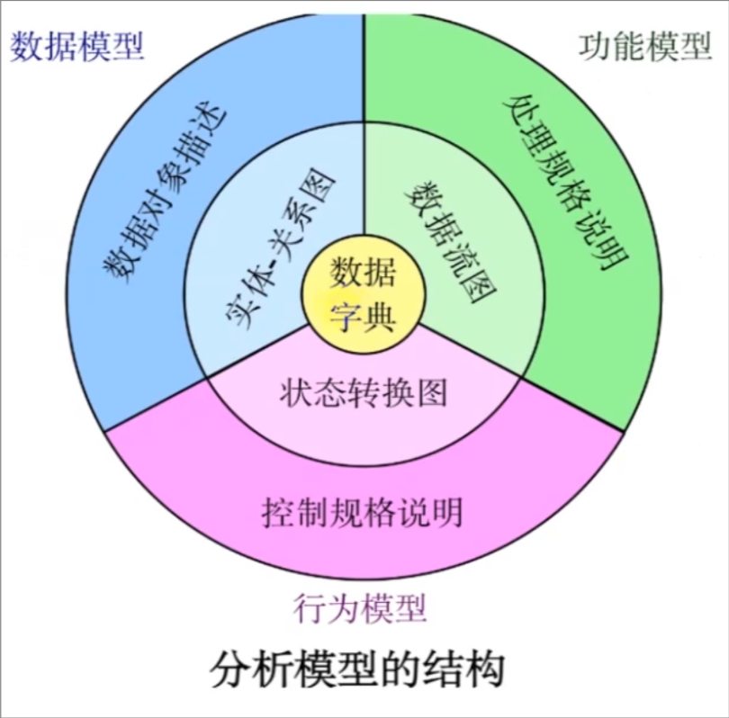
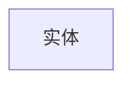
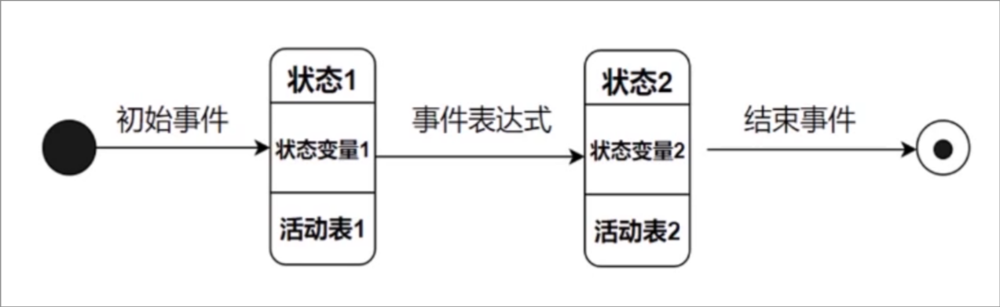
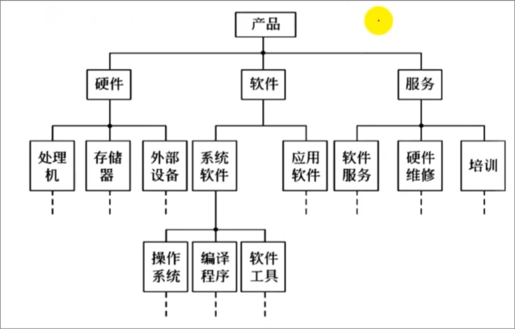
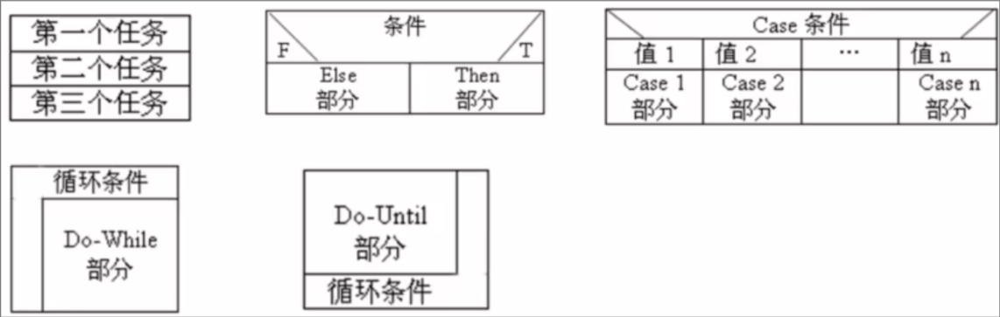
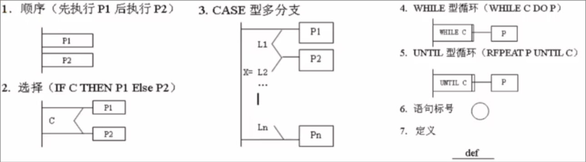
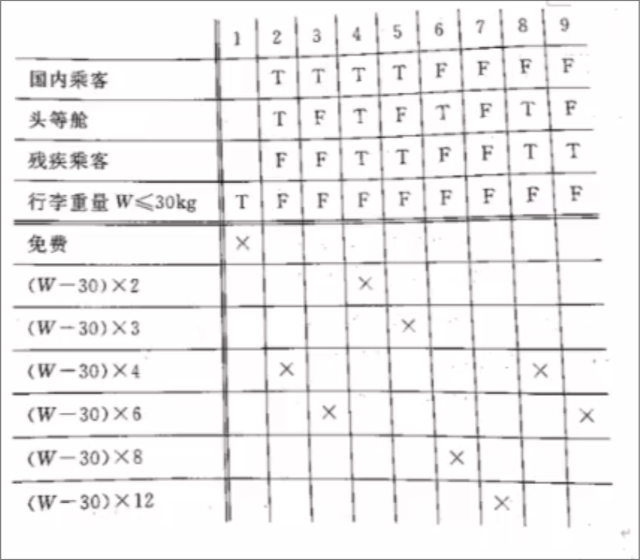
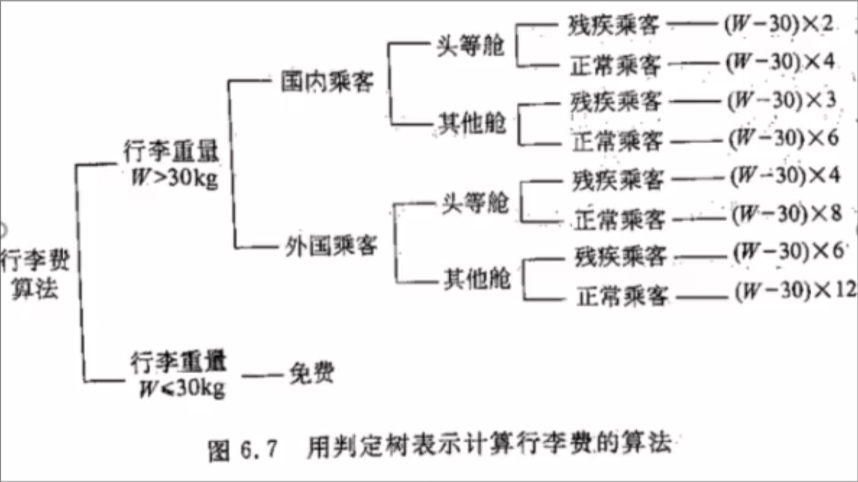

# 软件与软件危机

## 软件

在计算机系统的支持下，能完成特定功能和性能的**程序**(占10%~20%)、**数据**和相关的**文档**

### 分类

#### 按功能

- 系统软件
- 应用软件
- 支撑软件

## 软件危机

> 主要由软件问题引起，导致软件工程的出现

(由于落后的软件生产方式无法满足增长的需求)在计算机软件开发和维护过程中遇到的一系列严重问题

1. 如何开发软件
2. 如何维护软件

### 表现

- **计划**不准确
- **用户**不满意
- **质量**不可靠
- **系统**难维护
- **文档**不适合
- **成本**上升
- **开发**效率低

### 产生原因

1. 软件本身特点
    - 软件缺乏可见性
    - 可能存在测试阶段没能检测出来的错误
    - 软件维护通常意味着改正或修改原来的设计,使得软件较难维护
    - 软件规模庞大,随着规模增加复杂性呈指数上升
2. 软件开发维护方法不正确
    - **忽视软件需求分析重要性**,匆忙着手编程
    - 程序只是完整的软件产品的一个组成部分
    - 需要清除只重视程序而忽视软件配置其余成分的错误观念
    - 轻视维护是最大错误

### 消除方法

1. 对计算软件有**正确的认识**
2. 积累有效的**原理、概念、技术和方法**
3. 积极开发和使用**计算机辅助开发软件**
4. 探索更好的**管理措施**对开发过程进行管控

# 软件工程

> 由于软件危机的出现

指导计算机软件**开发和维护**的**工程学科**

1. 采用**工程**的概念、原理、技术和方法来**开发和维护**软件
2. 将**管理技术**与当前证明是正确的**技术方法**结合起来;
3. 强调使用**生存周期**方法学和**结构化技术**

## 基本原理

- 用分阶段软件生命周期计划进行质量管理
- 坚持阶段评审。
- 严格的产品控制。
- 现代程序设计技术。
- 结果应能清楚地审查。
- 开发小组人员少而精。
- 承认不断改进软件工程实践必要性。

## 方法学

软件生命周期中使用的一整套技术方法

**实现保证**是**软件开发工具**和**软件开发的环境**

### 三要素

**方法**,**工具**和**过程**

### 分类

#### 结构化方法学

结构化分析(SA)、设计(SD)、程序设计(SP)

> **结构化**程序设计的基本思想是采用**自顶向下、逐步细化的设计方法**和**单入单出**的控制结构

每阶段结束前严格审查复复核

#### 面向对象方法学

面向对象分析(OOA)、设计(OOD)、程序设计(OOP)

- 用**对象分解**取代传统方法学功能分解
- 所有对象划分成类
- 按父类和子类关系组成**层级结构**系统
- 对象间仅通过**发送消息**相互联系

# 软件生命周期

**软件产品**\/**软件系统**从设计、投入使用到被淘汰的全过程

> 三个时期八个阶段, 从时间角度

## 软件定义时期

1. **问题定义**: 弄清客户要解决的问题
2. **可行性研究**: 确定软件开发可行性，输出《可行性研究报告》
3. **需求分析**: 明确客户需求，输出标准化《需求规格说明书》

## 软件开发时期

> 分为概要\/总体设计和详细设计

1. **总体设计**: 设计软件结构，确定功能模块和**模块间关系**，输出《总体设计说明书》
2. **详细设计**: 详细设计每个模块，确定所需**算法和数据结构**，输出《详细设计说明书》
3. **编码和单元测试**: 将详细设计用语言实现，并测试每个模块，输出软件产品
4. **综合测试**: 编写详细测试计划并严格按计划进行

## 软件维护时期

- 运行和维护

# 软件开发模型

## 软件过程

整个软件生命周期的系统**开发运行和维护过程**所实施的全部过程活动和任务的结构框架。通常用软件过程模型来描述软件过程

## 软件过程模型

### 传统软件过程模型

- 瀑布模型(线性顺序模型)

    常采用的结构化生命周期方法

- 快速原型模型
- 增量模型
- 螺旋模型
- 喷泉模型

### 现代软件过程模型

- Rational统一过程(UML)
- 敏捷过程与极限编程
- 微软过程
- 基于构件的开发模型

### 瀑布模型


将软件生命周期的各项活动规定为按固定顺序而连接的若干工作阶段，形如瀑布流水

以**文档**为驱动、适合于**软件需求确定**的软件项目开发

#### 三个时期

##### 定义(计划)时期

- 可行性研究
- 需求分析

##### 开发时期

- 总体设计
- 详细设计
- 编码
- 单元测试
- 系统测试
- 验收测试

##### 维护(运行)时期

- 运行与维护

#### 特点

> 线性和顺序的开发模型

1. 具有**顺序性**和**依赖性**
2. 推迟实现观点，编码前的各阶段主要考虑逻辑模型而不涉及具体实现
3. 观点有质量保证，每阶段必须完成规定**文档**，结束都要对所完成观点进行**评审**

#### 优点

1. 强迫开发人员采用**规范化方法**
2. 严格规定每阶段必须提交的**文档**
3. 要求每个截断交出产品经过**验证**

#### 缺点

1. 仅通过静态规格说明，无法及时验证需求是否正确、完整
2. 完全依赖书面说明，很容易导致软件产品不能真正满足用户需求
3. 不支持产品演化，不够灵活，软件产品难以维护

### 快速原型模型


快速建立可运行的程序，它完成的功能往往是最终产品功能的一个子集。

#### 优点

1. 开发的软件产品通常满足用户需求
2. 软件产品开发基本是线性过程

#### 缺点

1. 准确原型设计困难
2. 原型理解可能不同
3. 不利于开发人员创新

### 增量模型


先完成一个系统子集的开发，再按同样的开发步骤增加功能 (系统子集),如此递增下去直至满足全部系统需求。

#### 优点

1. 短时间内可提交完成部分功能
2. 逐渐增加产品功能，用户适应产品快

#### 缺点

1. 增量构件划分以及集成困难
2. 容易退化为边做边改模型。

### 螺旋模型


在每个阶段之前都增加了风险分析过程的快速原型模型，看作增加了风险分析的快速原型模型。

#### 优点

1. 利于把软件质量作为软件开发目标
2. 减少测试
3. 维护和开发不分开

### 缺点

- 风险估计困难

### 喷泉模型


- 典型的面向对象软件过程模型，特点是**迭代、无间隙**。会将软件开发划分为多个阶段，但各个阶段无明显界限，并且可以迭代交义
- 迭代意味着模型中的开发活动常常需要重复多次，在迭代过程中不断地完善软件系统。无间隙是指在开发活动（如分析、设计、编码）之间不存在明显的边界

#### 优点

- 提高软件项目的开发效率，节省开发时间

#### 缺点

- 各个开发阶段是重叠的,开发过程中需要大量的开发人员,不利于项目的管理
- 要求严格管理文档，审核的难度加大。

# 可行性研究

用**最小代价**在**最短时间**内确定问题是否能解决(占5%~10%)

> 进行一次简化的、压缩的需求分析，给出行或不行的回答

## 任务

1. 定义问题(分析和澄清)
2. 导出**系统**模型
    - **物理**模型: **系统流程图**SFD
    - **逻辑**模型: **数据流图**DFD、**数据字典**DD
3. 探索解法
4. 研究可行性
    - **技术**可行性
    - **经济**可行性: [成本**效益分析**](#成本效益分析)
    - **操作(运行)**可行性
    - 其他: 法律，社会等

## 步骤

1. 复查**系统规模**和**目标**
2. 研究在**目前正在使用**的系统
3. 导出**新系统**的高层**逻辑模型**
4. 进一步**定义问题**
5. 导出和评价可供选择的**解法**
6. 推荐**行动方针**
7. 草拟**开发计划**
8. 书写**文档**提交审查

## 结果

1. 系统概述
2. 可行性研究
3. 拟定开发计划
4. 结论意见

# 系统流程图

描绘**物理**系统的**图**，表达**数据**在系统各部件之间**流动**的情况(自顶向下，从左到右)，不是对数据进行**加工处理**的控制过程


# 数据流图和数据字典

*数据流图*和*数据字典*共同构成系统的**逻辑模型**，适用于**结构化分析**阶段

## 数据流图

描绘**信息流和数据**从**输入**到**输出**过程所经受的**变换**的图

### 特点

1. **无**具体的**物理构件**，只描绘**数据流动**和被处理的**逻辑过程**
2. 是系统逻辑功能的**图形**表示
3. 设计时只需考虑基本**逻辑功能**，不考虑具体实现

### 基本符号

1. 正方形 表示外部实体，代表数据**源\/终点**
2. 圆形/圆角矩形 表示**加工**，代表变换数据的处理
3. 箭头线 表示**数据流**，数据流向和路径
4. 双实线 表示**数据存储**

    - 由于mermaid限制，下面用双方框替代

    ```mermaid
    graph LR
        test[[存储]]
    ```


### 绘制步骤

自顶向下，逐层细化

#### 基本成分

1. 源点和终点
2. 加工处理
    > 每个加工至少有一个输入流和一个输出流
3. 数据流
4. 数据存储

#### 实例

假设一家工厂的**采购部**每天**需要一张订货报表**,报表按零件编号排序,表中列出所有需要再次订货的零件。对于每个需要再次订货的零件应该列出下述数据零件编号,零件名称,订货数量,目前价格,主要供应者,次要供应者。零件入库或出库称为**事务**,通过放在**仓库**中的CRT终端把事务报告给订货系统。当某种零件的库存数量少于库存量临界值时就应该再次订货。

画出上述订货系统的数据流图。

#### 分析

1. 确定出采购员是数据终点，仓库管理员是数据源点
2. 寻找处理
    1. 产生订货报表
    2. 处理事务
3. 确定数据流
    1. 订货系统每天把订货报表送给采购部，**订货报表**是一个数据流
    2. 事务需要....，所以出入库**事务**是另一个数据流
4. 确定数据存储
    1. 零件出入库事务处理时徐哟有库存信息，必须有**库存清**单的数据存储
    2. 订货报表与订货信息生成，**订货信息**也应该有一个数据存储


#### 绘制

> 通过功能分解完成数据流图的细化

1. **顶层**数据流图
   任何系统基本模型都由**若干数据源点\/终点**以及一个**处理**组成，表示系统对数据加工变换的基本功能

    ```mermaid
    graph LR
     manager[仓库管理员] -- 事务 ---> system(订货系统) -- 订货报表 ---> buyer[采购员]
    ```

2. **细化**基本模型，描绘系统**主要功能**，为处理和存储数据**添加编号**

    ```mermaid
    graph TD
        manager[仓库管理员] -- 事务 ---> p1(处理事务)
        p1 --> d1[[D1 库存清单]]
        p1 -- 订货信息 --> d2[[D2 订货信息]]
        d2 -- 订货信息 --> p2(2 产生报表) -- 订货报表 --> 采购员
    ```

3. 进一步细化功能级数据流图中系统主要功能

    ```mermaid
    graph TD
        仓库管理员 --> |事务| p11(1.1 接收事务) --> |事务| p12(1.2 更新库存清单)
        p12 <--> |库存清单| d1[[D1 库存清单]]
        p12 --> |库存信息| p13(1.3 处理订货) --> d2[[D2 订货信息]] --> |订货信息| p2(2 产生报表) -->|订货报表| 采购员
    ```

## 数据字典

### 定义

关于**数据**的信息集合，即对数据流图中包含的所有元素**定义**的集合

### 内容

- **数据流**
- **数据流分量(数据元素)**
- **数据存储**
- **处理**

### 作用

作为**分析阶段**的工具，是**开发数据库**的第一步

### 定义数据方法

1. 组成方式
    - **顺序**
    - **选择**
    - **重复**
    - **可选**
2. 符号
    - = 等价
    - \+ 连接
    - [] 选一
    - | 隔开供选择的分量
    - {} 重复
    - () 可选

### 制作

#### 实例

假设一家工厂的**采购部**每天**需要一张订货报表**,报表按零件编号排序,表中列出所有需要再次订货的零件。对于每个需要再次订货的零件应该列出下述数据零件编号,零件名称,订货数量,目前价格,主要供应者,次要供应者。零件入库或出库称为**事务**,通过放在**仓库**中的CRT终端把事务报告给订货系统。当某种零件的库存数量少于库存量临界值时就应该再次订货。

画出上述订货系统的数据流图，并建立重要条目的数据字典。

##### 数据字典内容

- D1 库存清单 = 零件编号 + 零件名称 + 订货数量 + 目前价格 + 主要供应者 + 次要供应者
- D2 订货信息 = 零件编号 + 订货数量 + 订货时间
- 零件编号 = 8{字符}8
    > x{y}z y重复x到z次
- 订货数量 = 1{数字}5

# 成本效益分析

从**经济角度**分析新系统的开发是否能**盈利**，帮助使用部门正确做出**是否**投资的决定

> 估算软件项目成本

## 估算方法

1. 代码行技术
    - 软件成本 = 每行代码平均成本 \* 源代码行数
2. 任务分解技术
    - **分解任务，分别估算，累加**
    - 每个任务成本 = 人力 \* 人平均工资
3. 自动估计成本
    - 以长期搜集的大量历史数据为基础，需良好的数据库支持

## 成本\/效益分析方法

1. 货币时间价值，通常用利率的形式表示货币时间价值

    - 假设年利率为$i$，现在存入$p$元，n年后可以得到: $F=P(1 + i)^n$
    - 反之，如果$n$年后能收入$F$元，那么这些钱现在的价值是$P=F/(1+i)^n$

2. 投资回收期
3. 纯收入
4. 投资回收率

# 需求分析

> 研究对象是用户要求

> **影响最大**，在这阶段排查错误

以上为用例之间的关系
软件定义时期最后且最重要环节，准确回答**系统做什么**这个问题，产生一份详尽的**需求规格说明书**

## 原因

1. 是软件开发的**基础**和前提，必须了解**用户需求**
2. 是**软件系统验收的标准**
3. 能避免或尽早剔除**早期**错误，确定**综合要求**

## 任务

> 不包含设计

1. 确定<span id="req">**综合要求**</span>
    - 功能需求
    - 性能需求
    - 可靠性和可用性需求
    - 出错处理需求
    - 接口需求
    - 约束
    - 逆向需求
    - 将来可能提出的要求
2. 分析系统的**数据要求**
    1. 建立**数据模型**
    2. 描绘数据结构(常用图形工具)
        - **层次方框图**
        - **Warnier图**
        - **IPO图**
    3. 导出系统逻辑模型
        - [数据流图](#数据流图)
        - [数据字典](#数据字典)
        - 实体联系图
        - 状态转换图
    4. 修正**开发计划**

## 需求获取方法

1. 访谈
2. 面向数据流自顶向下
3. 简易应用规格说明计术
4. 快速建立软件原型

## 分析建模

### 模型

为了理解事物而对事物做出的一种**抽象**，一种**歧义的书面描述**

- 行为模型
  - [状态转换图](<#状态转换图(STD)>)
- 数据模型 描绘数据对象以及数据对象间的关系
  - [实体联系图](#实体联系图)
- 功能模型
  - [数据流图](#数据流图)



## 软件需求规格说明

> 不包含实现过程(如算法的详细描述)

是需求分析阶段得出的**最主要的文档**

通常用自然语言完整准确具体地描述系统的[一系列要求](#req)，此外还有数据要求

# 实体联系图

## 数据模型

一种面向**问题**的**数据模型**，按照**用户**观点对**数据**建立的模型。描述用户角度看到的数据，与实现方法**无关**

### 构成

1. 数据对象
    - 对软件必须理解的复合信息抽象
2. 属性
    - 定义了数据对象的性质
3. 联系
    - 数据对象彼此相互连接的方式(关系)
        1. 一对一 1:1
        2. 一对多 1:N
        3. 多对多 M:N

## 实体联系图(E-R图)

### 定义

可以用来**建立数据模型**。利用ER图描绘的数据模型称之为E-R模型，用于描述**数据流图**中的**数据存储**及其之间的关系，可用于数据库概念设计。实体联系图可作为**用户**与**分析员**之间有效的**交流工具**

1. 实体: 数据对象
2. 属性: 数据对象**性质**
3. 联系: 数据对象间**交互方式**

### 表示方式

1. 实体



2. 联系


3. 属性


### 绘制方式

1. 找出所有**实体**
    - 如学生，课程
2. 确定实体间**联系**
    - 1:1,1:N
    - **联系**也有**属性**
3. 完善实体**属性**
    - 学号，性别...

# 状态转换图(STD)

描绘系统的**状态**及引起系统状态转换的**事件**来表示系统行为

- **状态**: 任何可以被观察到的**系统行为模式**，规定了系统对事件的**响应方式**
- **事件**: 在某个**特定时刻**发生的事，引起系统做动作或(和)转换状态的**控制信息**

## 符号表示

- 初态: 实心圆
  - 只能有一个
- 终态: 同心圆，内为实心
- 状态: 圆角矩形
  - 上部分是状态名称
  - 中部分是状态变量名字和值
  - 下部分是活动表



## 其他图形工具

### 层次方框图

- 用**树形**结构的一系列矩形框描绘**数据**的**层次结构**
- 随着结构逐步精细，对数据结构描绘也越来越详细



### Warnier图

- 用**树形**结构描绘信息的层次结构
- 可以标明信息的逻辑组织，某类信息出现条件或是否重复出现

### IPO图

输入、处理、输出图的简称，能方便地描绘**输入数据、对数据的处理和输出数据**之间的关系

### HIPO图

表示完整软件结构

# 验证软件需求

## 四个方面与验证

1. 一致性: 需求保持一致不矛盾
    - **自然语言描述**，**形式化语言描述**，使用**软件工具**验证
2. 完整性: 规格说明包括用户所需所有完整功能
    - 参照**开发经验**
3. 现实性: 能用现有硬件和软件技术实现
    - 建立**软件原型**
4. 有效性: 需求正确有效，确实能解决问题
    - 建立**软件原型**

## 需求分析软件工具

- PSL(问题陈述语言)
- PSA(问题陈述分析程序)

# 总体设计

又称为**概要**设计或**初步**设计

任务

- 确定每个程序由**哪些模块**组成以及这些**模块间的关系**
- 划分出物理元素(程序、文件、数据库等)

## 设计过程

包括**系统**设计和**结构**设计阶段

**系统设计阶段**

1. 设想供选择的方案: 数据流图出发，将处理分组抛弃行不通分组。
2. 选取合理的方案: 上一步方案选取低、中、高成本三种方案。

β一般取0.25 3. 推荐最佳方案: 推荐最佳方案，制定详细实现计划

**结构设计阶段**

4. 功能分解: 对数据流图进一步细化，进行功能分解。可以用IPO图等工具描述细化后每个处理的算法。
5. 设计软件结构：层次图或结构图描绘软件结构。或数据流图导出软件结构。
6. 设计数据库
7. 制定测试计划
8. 书写文档
9. 审查和复审

## 设计原理

- 模块化
  - **模块**: 单独命名，构成程序的基本构件
  - **模块化**: 程序划分成独立命名且可独立访问的模块
- 抽象
  - 抽出事务**本质特性**，暂不考虑细节
- 逐步求精
  - 逐步揭露底层细节
  - Miller法则: 注意力集中在(7+-2上)
- 信息隐藏和局部化
  - 信息隐藏: 不需要特定信息的模块不能访问对以对应欧内盖信息
  - 局部化: 把一些关系密切的软件元素**物理**地放得彼此靠近
- 模块独立
  - 模块独立性：是模块化、抽象、信息隐蔽和局部化概念的直接结果。
  - 模块独立是好设计的关键，设计是决定软件质量的关键环节。
  - 度量标准：耦合、内聚

同其它模块强耦合的模块意味着弱内聚；强内聚模块意味着与其它模块间松散耦合

软件设计目标: **高内聚、低耦合**

### 耦合

- 是对一个软件结构内不同**模块之间**互连程序的度量。
- 耦合强度取决于模块接口的复杂程度、通过接口的数据等
- **耦合性越高，模块独立性越弱。**

**耦合分类**(程度从低->高):

1. 无直接耦合
2. 数据耦合
3. 标记耦合(特征耦合)
4. 控制耦合
5. 外部耦合
6. 公共耦合
7. 内容耦合

### 内聚

是用来度量一个模块内部各个元素彼此结合的紧密程度的。

**内聚分类**(程度从低->高):

- 偶然内聚
- 逻辑内聚
- 时间内聚
- 过程内聚
- 通信内聚
- 顺序内聚
- 功能内聚

    > 最好的

## 启发规则

- 深度: 软件控制层数
- 扇出: 模块调用数目
- 扇入: 被调用数目
- 宽度: 同一层次上模块总数最大值

好的软件结构顶层扇出比较高，中层扇出比较少，底层扇入到公共的实用模块中，即底层模块有高扇入。

- 模块的**作用域**应该在**控制域**之内
  - 作用域：指受该模块内**一个判定影响的所有模块**的集合。
  - 控制域：是这个**模块本身以及所有直接或间接从属于它的模块**的集合。
- 力争降低模块接口的复杂程度
- 设计单入口单出口的模块
- 模块功能应该可以预测

## 描绘软件结构的图形工具

TODO

# 详细设计

## 任务目的

### 目的

确定怎样具体地实现所要求的系统

### 任务

1. 过程设计: 包含的每个模块的算法
2. 数据设计: 数据结构
3. 接口设计: 软件内部各模块之间接口

## 结构程序设计

只用**三种基本控制结构**就能实现任何**单出入口**的程序

三种基本控制结构

- 选择结构
- 顺序结构
- 循环结构

### 控制结构

- **经典**的结构程序设计: 三种基本结构
- **扩展**的...: 除了基本的还包括Do-case(switch)和Do-Until(do while)
- **修正**的...: 除了基本和扩展还是用**break**结构

## 人机界面

接口设计的重要组成部分

经常遇到的四个问题:

- 系统响应时间

    重要属性: **长度**和**易变性**

- 用户帮助设施
- 出错信息处理
- 命令交互

设计指南:

- **一般交互**指南
- **信息显示**指南
- **数据输入**指南

## 过程设计工具

描述程序处理过程的工具

- 程序流程图
    又称为程序框图，最悠久最广泛也最混乱

    ```mermaid
    graph LR
        se([开始/结束])
        proc[处理]
        check{判断}
    ```

- 盒图(N/S图)

    不允许违背结构程序设计精神的图形工具

    

- PAD图

    二维树形结构图来表示控制流，容易翻译成程序代码

    

- 判定表

    算法中包含多重嵌套的条件选择时判定表却能够清晰地表示复杂的条件组合与应做的动作之间的对应关系。

    组成:

  - 左上部列出所有条件，左下部是所有可能的动作。
  - 右上部是表示各种条件组合，右下部是和每种条件组合相对应的动作。



- 判定树
    
- 过程设计语言

## 程序复杂度定量度量

程序复杂度 = 流程图封闭区域个数(包括最外部的区域) = 边个数 - 节点个数 + 2 = 判定节点个数(只要有多个分支就算) + 1

定量的度量详细设计模块的质量

# 集成测试

> 大型软件测试包括**单元测试**，**集成测试**，**确认测试**和**系统测试**

## 概念

检验**软件单元之间**、**软件单元和已集成的软件系统之间**的接口关系，并验证已集成软件系统是否符合设计要求。

**目标**: **发现**与接口有关的**问题**

**实施者**: 独立测试机构或第三方人员

### 集成方法(**主要方法**)

- 非渐增测试
- 渐增测试

  - 自顶向下集成: 从主控模块开始沿着程序控制层次自顶向下移动逐步添加新模块，组合模块有两种策略

    - 深度优先策略
    - 广度优先策略

    - 优点: 不需要测试驱动程序，能够在测试阶段的早期实现并验证系统的主要功能，而且能够尽早发现上层模块的接口错误。
    - 缺点: 需要存根程序，底层错误发现较晚

  - 自底向上集成: 从最底层模块开始组装
    - 优缺点与自顶向下相反

自顶向下和自底向上相结合:

- 上层模块使用自顶向下方法
- 下层模块自底向上

> 单元测试以白盒测试为主，黑盒测试为辅

## 回归测试

**重新执行**已经**做过测试**的某个子集，以保证程序的变化没有带来非预期的副作用。

## 确认测试

> 发现需求分析阶段的错误

又称**验收测试**，目标是验证软件的有效性

- **验证**：为了保证软件正确的实现了某个特定要求而进行的一系列活动
- **确认**：为了保证软件确实满足了用户需求而进行的一系列活动。
    1. Alpha测试：用户在开发者的场所，在开发者指导下进行。
    2. Beta测试：，用户在用户场所进行，遇到问题报告给开发者，开发者进行修改。

## 白盒测试

> 根据内部逻辑和指定覆盖标注

**测试用例**：测试输入数据和预期的输出结果。
**测试方案**：测试目的、测试用例的集合。

- 语句覆盖: 被测试程序中的**每条语句**至少执行一次。

    > 最弱覆盖标准

- 判定(分支)覆盖: 使得被测程序中**每个判定表达式**至少获得一次“真”值和“假”值
- 条件覆盖: 使得判定表达式中**每个条件**的**各种可能的值**至少出现一次。
- 条件组合覆盖: 设计足够多的测试用例，使得每个判定表达式中条件的**各种可能的值的组合**都至少出现一次。
- 路径覆盖: 覆盖被测程序中所有**可能的路径**。

### 控制结构测试

- 基本路径测试
- 条件测试
- 循环测试

## 黑盒测试

又称功能测试，着重测试软件的功能

### 等价类划分法

**最常用**

1. 把程序的输入数据集合按输入条件划分为若干个等价类，每一个等价类相对于输入条件表示为一组**有效**或**无效**的输入。
2. 为每一等价类设计一个测试用例。

### 边界值分析法

输入等价类和输出等价类的边界就是应该着重测试的程序边界情况。选取的测试数据应该刚好**等于**、刚好**小于**、刚好**大于**边界值

> 取值范围为[-1, 1]，考虑测试用例[-1.001, -1.0, 1.0, 1.001]

## 调试

调试（也称为纠错）是在测试发现错误之后排除错误的过程

是在测试发现错误之后排除错误的过程

## 软件可靠性

软件**可靠性**：程序在给定**时间间隔**内，按照规格说明书的规定成功运行的概率。
软件**可用性**：程序在给定**时间点**，按照规格说明书的规定成功运行的概率。

# 软件维护

## 定义

是在软件已经交付使用之后，为了改正错误或满足新的需要而修改软件的过程。

**分类**:

- 改正性维护：诊断和改正错误的过程(17%~21%)。
- 适应性维护：为了和变化了的环境适当地配合而进行的修改软件的活动(18%\~25%)。
- 完善性维护：为了满足在用户提出的增加新功能或修改已有功能的要求和一般性的改进要求(50\~66%)。
- 预防性维护：(4%)

## 特点

- 结构化维护与非结构化维护差别巨大
  - 非结构化维护:惟一成分是程序代码，那么维护活动从艰苦地评价程序代码开始。
  - 结构化维护:有完整的软件配置存在，那么维护工作从评价设计文档开始。
- 维护的代价高昂
- 维护的问题很多
    > 理解别人写的程序通常非常困难维护的软件往往没有合格的文档，或者文档资料显著不足。要求对软件进行维护时，不能指望由开发人员给我们仔细说明软件。绝大多数软件在设计时没有考虑将来的修改。软件维护不是一项吸引人的工作。

## 软件可维护性

维护人员理解、改正、改动或改进这个软件的难易程度。

决定软件可维护性的因素：

- 可理解性:读者**理解**软件的难易程度
- 可测试性:论证程序**正确性**的容易程度。
- 可修改性:程序**容易修改**的程度。
- 可移植性:把程序从一种计算环境（硬件配置和操作系统）**转移**到另一种计算环境的难易程度。
- 可重用性:同一个软件不做修改或稍加改动，就可以在不同环境中**多次重复使用**

## 预防性维护

- 为了提高未来的可维护性或可靠性，而主动地修改软件。
- 也称为软件再工程。

### 软件再工程过程

- 库存目录分析:分析可能成为预防性维护的对象

    在今后数年内继续使用

    当前正在成功使用的程序

    可能最近的将来要做较大程度的修改或扩充

- 文档重构:

    如果一个程序稳定，正在走向生命终点，不必为它再建立文档

    只建立系统中当前正在修改的那部分的完整文档

    尽量把文档工作减少到必须的最小量

- 逆向工程:

    分析程序，以便在比源代码更高的抽象层次上创建出程序的某种描述的过程。

- 代码重构:

    重构一些编码方式难理解、测试和维护的模块代码

- 数据重构:

    对数据体系结构进行修改维护

- 正向工程:

    利用现代软件工程概念、原理、技术和方法，重新开发现有的某个应用系统

# 面向对象方法学

按人类习惯的**思维方法**，以现实世界中客观存在的**对象**为中心来思考和认识问题。

采用的思想方法与原则：抽象、分类、继承、聚合、封装等。

**面向对象＝对象＋类＋继承＋通信**

## 开发方法

- 面向对象**分析**
- 面向对象**设计**
- 面向对象**实现**

## 优点

1. 与人类习惯的思维方法一致
2. 稳定性好
3. 可重用性好
4. 较易开发大型软件产品
5. 可维护性好

## 概念

对象三要素包括**属性，方法和事件**
对象三种成分包括**标识，属性和方法**

**对象**: 在应用领域中有意义的、与所要解决的问题有关系的任何事物都可以作为对象，包括具体的物理实体 的抽象、人为的概念、任何有明确边界和意义的东西。

对象既有静态属性，又有动态属性

### 基本要素

- 属性: 用来描述对象静态特征的一个数据项；
- 服务: 用来描述对象动态特征（行为）的一个操作序列

对象的属性和所有操作封装在一起，构成一个统一体。 属性一般只能通过执行对象的操作来改变。

#### 类

具有相同属性和服务的一组对象的集合，它为属于该类的全部对象提供了统一的抽象描述。

#### 实例

是某个特定类所描述的一个具体对象。

#### 消息

对象之间通信的手段，是一个对象要求另一对象执行类中定义的某个操作的规格说明。

#### 方法

对象所能执行的操作称为方法，也就是类中所定义的服务。方法描述了对象执行的功能、响应消息的操作。

#### 属性

属性是对客观世界实体所具有的性质的抽象，是类中所定义的数据。

#### 封装

封装是把对象的属性和实现操作的代码结合成一个独立的系统单位，并尽可能隐藏对象的内部细节，对象以外的部分不能直接作用于对象的内部数据（属性），对象间的通信只能通过明确的消息来进行。

#### 继承

直接获得已有的性质和特征，而不必重复它们。

#### 父类、子类、超类

- 父类：一个类的上层是父类。
- 子类：一个类的下层是子类。
- 超类：父类的父类为超类。

#### 单继承与多继承

- 单继承：一个类只允许有一个父类，即类等级为树形结构。
- 多继承：一个类允许有多个父类

#### 继承的优点

- 使得相似的对象可以共享程序代码和数据结构，大大减少程序中的冗余信息。
- 便于软件修改维护。
- 用户在开发新系统时不必从零开始，可以继承原有相似功能或者从类库中选取需要的类，再派生新类。

#### 多态性

指对象根据所接受的消息而做出动作，同样的消息为**不同的对象**接受时可导致**完全不同的行动**。

#### 重载

- 函数重载: 在同一作用域，**若干个参数特征不同**的函数可以使用**相同的函数名**
- 运算符重载: 同**一个运算符**可以施加于**不同类型**的操作数上面。

## 面向对象建模

模型：是一组图示符号和组织这些符号的**规则**，利用它们来定义和描述问题域中的术语和概念。

- **对象模型**(object model) ：定义**实体**，描述系统数据，定义“对谁做”
- **动态模型**(dynamic model) ：描述系统控制结构, 规定“**何时**做”
- **功能模型**(functional model) ：描述系统功能, 指明系统应“**做什么**”

## 对象模型

UML中，对象模型通常由“类图” 组成。

> UML的各类图中，用例图是描述软件功能的

类和类之间的联系称为“关系”。通常分为

- 关联: 在类之间画一条连线。
- 聚集: 包括共享聚合和组合聚合。
- 范化: 继承性的体现。
- 依赖和细化

以上为**用例之间的关系**

## 功能模型

数据流图和用例图来描述功能模型

## 三种模型之间的关系

- 功能模型指明系统必须做什么；
- 动态模型规定什么时候做；
- 对象模型定义了做事情的实体。

# 软件项目管理

通过计划、组织和控制等一系列活动，合理地配置和使用各种资源，以达到既定目标的过程

## 估算软件规模

### 代码行技术

根据以往开发经验和历史数据，估算实现一个功能所需源代码行数。

- 优点:代码是所有项目都有的“产品”,容易计算代码行数。
- 缺点:
  - 源代码为软件配置的一个部分，用来衡量整个软件规模不太合理。
  - 不同语言实现同一软件所需代码行数不相同。
  - 不适用于非过程语言。

### 功能点技术

以功能点（FP）为单位度量软件规模

## 工作量估算

## 进度计划

- 甘特图(Gantt图)

    甘特图是制定进度计划的工具,优点是能形象描述任务分解情况，直观简洁和容易掌握。

- 工程网络

## 质量保障

软件质量:就是“软件与明确地和隐含地定义的需求相一致的程度”

保障措施

- 基于非执行测试（复审或评审）
- 基于执行测试（软件测试）
- 程序正确性证明（数学方法）

## 软件配置管理

在软件生命期内管理变化的一组活动，用来标识、控制、报告变化，确保适当的实现了变化。

**基线**: 通过了正式复审的软件配置项，可以作为进一步开发的基础，只有通过正式的变化控制过程才能改变它。

软件配置管理**5项任务**:

- 标识对象
- 版本控制
- 变化控制
- 配置审计
- 状态报告

## 能力成熟度模型

是用于评价软件机构的软件过程能力成熟度模型，用于帮助软件开发机构建立一个有规模的，成熟的软件过程。

五个等级从低到高

- 初始级
- 可重复级
- 已定义级
- 已管理级
- 优化级
