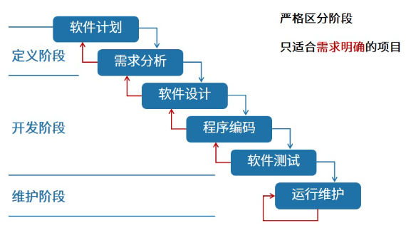
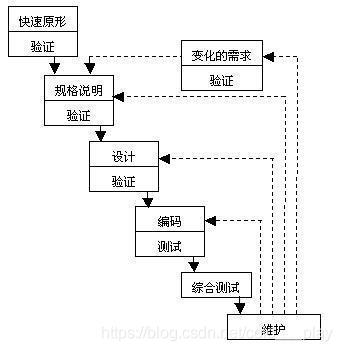
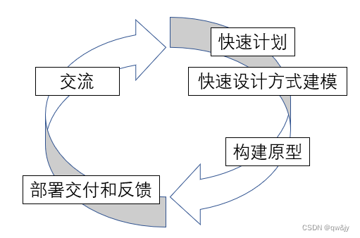
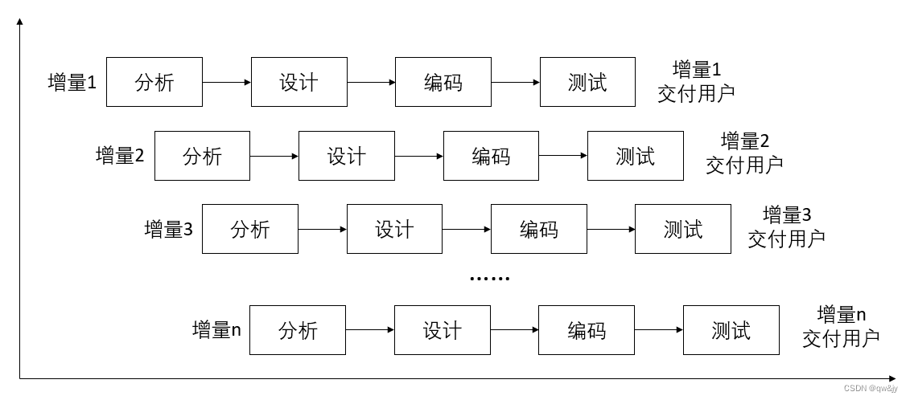
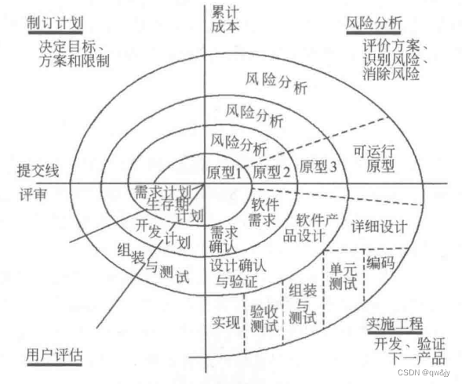
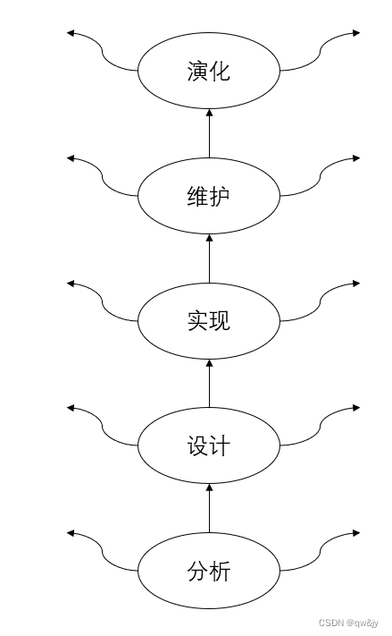
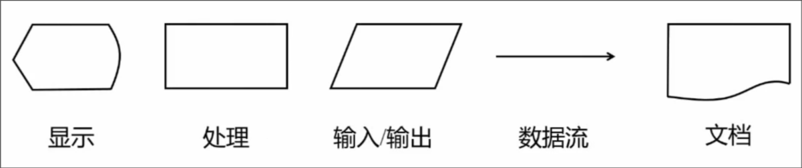
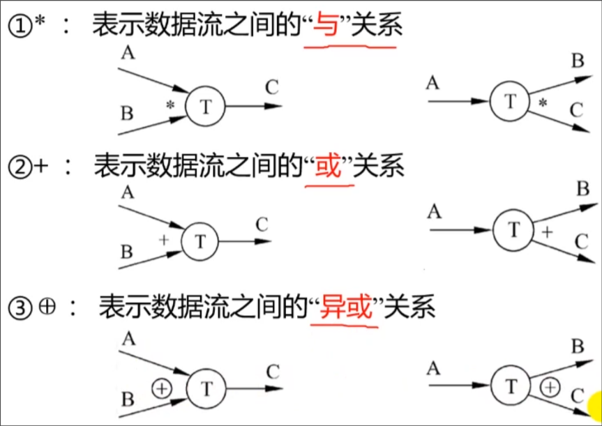
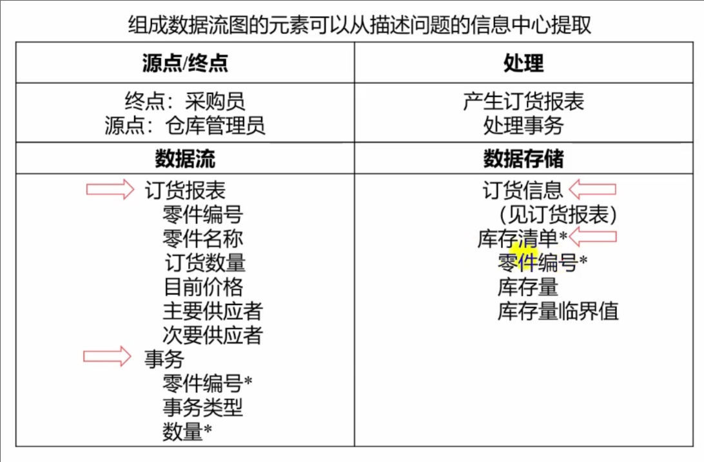

# 软件与软件危机

## 软件

在计算机系统的支持下，能完成特定功能和性能的**程序**(占10%~20%)、**数据**和相关的**文档**

### 分类

#### 按功能

- 系统软件
- 应用软件
- 支撑软件

## 软件危机

> 主要由软件问题引起

(由于落后的软件生产方式无法满足增长的需求)在计算机软件开发和维护过程中遇到的一系列严重问题

1. 如何开发软件
2. 如何维护软件

### 表现

- **计划**不准确
- **用户**不满意
- **质量**不可靠
- **系统**难维护
- **文档**不适合
- **成本**上升
- **开发**效率低

### 产生原因

1. 软件本身特点
    - 软件缺乏可见性
    - 可能存在测试阶段没能检测出来的错误
    - 软件维护通常意味着改正或修改原来的设计,使得软件较难维护
    - 软件规模庞大,随着规模增加复杂性呈指数上升
2. 软件开发维护方法不正确
    - **忽视软件需求分析重要性**,匆忙着手编程
    - 程序只是完整的软件产品的一个组成部分
    - 需要清除只重视程序而忽视软件配置其余成分的错误观念
    - 轻视维护是最大错误

### 消除方法

1. 对计算软件有**正确的认识**
2. 积累有效的**原理、概念、技术和方法**
3. 积极开发和使用**计算机辅助开发软件**
4. 探索更好的**管理措施**对开发过程进行管控

# 软件工程

> 由于软件危机的出现

指导计算机软件**开发和维护**的**工程学科**

1. 采用**工程**的概念、原理、技术和方法来**开发和维护**软件
2. 将**管理技术**与当前证明是正确的**技术方法**结合起来;
3. 强调使用**生存周期**方法学和**结构化技术**

## 基本原理

- 用分阶段软件生命周期计划进行质量管理
- 坚持阶段评审。
- 严格的产品控制。
- 现代程序设计技术。
- 结果应能清楚地审查。
- 开发小组人员少而精。
- 承认不断改进软件工程实践必要性。

## 方法学

软件生命周期中使用的一整套技术方法

### 三要素

**方法**,**工具**和**过程**

### 分类

#### 结构化方法学

结构化分析(SA)、设计(SD)、程序设计(SP)

每阶段结束前严格审查复复核

#### 面向对象方法学

面向对象分析(OOA)、设计(OOD)、程序设计(OOP)

- 用**对象分解**取代传统方法学功能分解
- 所有对象划分成类
- 按父类和子类关系组成**层级结构**系统
- 对象间仅通过**发送消息**相互联系

# 软件生命周期

**软件产品**\/**软件系统**从设计、投入使用到被淘汰的全过程

> 三个时期八个阶段, 从时间角度

## 软件定义时期

1. **问题定义**: 弄清客户要解决的问题
2. **可行性研究**: 确定软件开发可行性，输出《可行性研究报告》
3. **需求分析**: 明确客户需求，输出标准化《需求规格说明书》

## 软件开发时期

> 分为概要\/总体设计和详细设计

1. **总体设计**: 设计软件结构，确定功能模块和模块间关系，输出《总体设计说明书》
2. **详细设计**: 详细设计每个模块，确定所需算法和数据结构，输出《详细设计说明书》
3. **编码和单元测试**: 将详细设计用语言实现，并测试每个模块，输出软件产品
4. **综合测试**: 编写详细测试计划并严格按计划进行

## 软件维护时期

- 运行和维护

# 软件开发模型

## 软件过程

整个软件生命周期的系统**开发运行和维护过程**所实施的全部过程活动和任务的结构框架。通常用软件过程模型来描述软件过程

## 软件过程模型

### 传统软件过程模型

- 瀑布模型(线性顺序模型)
- 快速原型模型
- 增量模型
- 螺旋模型
- 喷泉模型

### 现代软件过程模型

- Rational统一过程(UML)
- 敏捷过程与极限编程
- 微软过程
- 基于构件的开发模型

### 瀑布模型



将软件生命周期的各项活动规定为按固定顺序而连接的若干工作阶段，形如瀑布流水

以**文档**为驱动、适合于**软件需求确定**的软件项目开发

#### 三个时期

##### 定义时期

- 可行性研究
- 需求分析

##### 开发时期

- 总体设计
- 详细设计
- 编码
- 单元测试
- 系统测试
- 验收测试

##### 维护时期

- 运行与维护

#### 特点

> 线性和顺序的开发模型

1. 具有**顺序性**和**依赖性**
2. 推迟实现观点，编码前的各阶段主要考虑逻辑模型而不涉及具体实现
3. 观点有质量保证，每阶段必须完成规定**文档**，结束都要对所完成观点进行**评审**

#### 优点

1. 强迫开发人员采用**规范化方法**
2. 严格规定每阶段必须提交的**文档**
3. 要求每个截断交出产品经过**验证**

#### 缺点

1. 仅通过静态规格说明，无法及时验证需求是否正确、完整
2. 完全依赖书面说明，很容易导致软件产品不能真正满足用户需求
3. 不支持产品演化，不够灵活，软件产品难以维护

### 快速原型模型





快速建立可运行的程序，它完成的功能往往是最终产品功能的一个子集。

#### 优点

1. 开发的软件产品通常满足用户需求
2. 软件产品开发基本是线性过程

#### 缺点

1. 准确原型设计困难
2. 原型理解可能不同
3. 不利于开发人员创新

### 增量模型



先完成一个系统子集的开发，再按同样的开发步骤增加功能 (系统子集),如此递增下去直至满足全部系统需求。

#### 优点

1. 短时间内可提交完成部分功能
2. 逐渐增加产品功能，用户适应产品快

#### 缺点

1. 增量构件划分以及集成困难
2. 容易退化为边做边改模型。

### 螺旋模型



在每个阶段之前都增加了风险分析过程的快速原型模型，看作增加了风险分析的快速原型模型。

#### 优点

1. 利于把软件质量作为软件开发目标
2. 减少测试
3. 维护和开发不分开

### 缺点

- 风险估计困难

### 喷泉模型



- 典型的面向对象软件过程模型，特点是迭代、无间隙。会将软件开发划分为多个阶段，但各个阶段无明显界限，并且可以迭代交义
- 迭代意味着模型中的开发活动常常需要重复多次，在迭代过程中不断地完善软件系统。无间隙是指在开发活动（如分析、设计、编码）之间不存在明显的边界

#### 优点

- 提高软件项目的开发效率，节省开发时间

#### 缺点

- 各个开发阶段是重叠的,开发过程中需要大量的开发人员,不利于项目的管理
- 要求严格管理文档，审核的难度加大。

# 可行性研究

用**最小代价**在**最短时间**内确定问题是否能解决(占5%~10%)

> 进行一次简化的、压缩的需求分析，给出行或不行的回答

## 任务

1. 定义问题(分析和澄清)
2. 导出**系统**模型
    - **物理**模型: **系统流程图**SFD
    - **逻辑**模型: **数据流图**DFD、**数据字典**DD
3. 探索解法
4. 研究可行性
    - **技术**可行性
    - **经济**可行性: [成本**效益分析**](#成本效益分析)
    - **操作(运行)**可行性
    - 其他: 法律，社会等

## 步骤

1. 复查**系统规模**和**目标**
2. 研究在**目前正在使用**的系统
3. 导出**新系统**的高层**逻辑模型**
4. 进一步**定义问题**
5. 导出和评价可供选择的**解法**
6. 推荐**行动方针**
7. 草拟**开发计划**
8. 书写**文档**提交审查

## 结果

1. 系统概述
2. 可行性研究
3. 拟定开发计划
4. 结论意见

# 系统流程图

描绘**物理**系统的**图**，表达**数据**在系统各部件之间**流动**的情况(自顶向下，从左到右)，不是对数据进行**加工处理**的控制过程



# 数据流图和数据字典

*数据流图*和*数据字典*共同构成系统的**逻辑模型**，适用于**结构化分析**阶段

## 数据流图

描绘**信息流和数据**从**输入**到**输出**过程所经受的**变换**的图

### 特点

1. **无**具体的**物理构件**，只描绘**数据流动**和被处理的**逻辑过程**
2. 是系统逻辑功能的**图形**表示
3. 设计时只需考虑基本**逻辑功能**，不考虑具体实现

### 基本符号

1. 正方形 表示外部实体，代表数据**源\/终点**
2. 圆形/圆角矩形 表示**加工**，代表变换数据的处理
3. 箭头线 表示**数据流**，数据流向和路径
4. 双实线 表示**数据存储**

    - 由于mermaid限制，下面用双方框替代

    ```mermaid
    graph LR
        test[[存储]]
    ```



### 绘制步骤

自顶向下，逐层细化

#### 基本成分

1. 源点和终点
2. 加工处理
    > 每个加工至少有一个输入流和一个输出流
3. 数据流
4. 数据存储

#### 实例

假设一家工厂的**采购部**每天**需要一张订货报表**,报表按零件编号排序,表中列出所有需要再次订货的零件。对于每个需要再次订货的零件应该列出下述数据零件编号,零件名称,订货数量,目前价格,主要供应者,次要供应者。零件入库或出库称为**事务**,通过放在**仓库**中的CRT终端把事务报告给订货系统。当某种零件的库存数量少于库存量临界值时就应该再次订货。

画出上述订货系统的数据流图。

#### 分析

1. 确定出采购员是数据终点，仓库管理员是数据源点
2. 寻找处理
    1. 产生订货报表
    2. 处理事务
3. 确定数据流
    1. 订货系统每天把订货报表送给采购部，**订货报表**是一个数据流
    2. 事务需要....，所以出入库**事务**是另一个数据流
4. 确定数据存储
    1. 零件出入库事务处理时徐哟有库存信息，必须有**库存清**单的数据存储
    2. 订货报表与订货信息生成，**订货信息**也应该有一个数据存储



#### 绘制

> 通过功能分解完成数据流图的细化

1. **顶层**数据流图
   任何系统基本模型都由**若干数据源点\/终点**以及一个**处理**组成，表示系统对数据加工变换的基本功能

    ```mermaid
    graph LR
     manager[仓库管理员] -- 事务 ---> system(订货系统) -- 订货报表 ---> buyer[采购员]
    ```

2. **细化**基本模型，描绘系统**主要功能**，为处理和存储数据**添加编号**

    ```mermaid
    graph TD
        manager[仓库管理员] -- 事务 ---> p1(处理事务)
        p1 --> d1[[D1 库存清单]]
        p1 -- 订货信息 --> d2[[D2 订货信息]]
        d2 -- 订货信息 --> p2(2 产生报表) -- 订货报表 --> 采购员
    ```

3. 进一步细化功能级数据流图中系统主要功能

    ```mermaid
    graph TD
        仓库管理员 --> |事务| p11(1.1 接收事务) --> |事务| p12(1.2 更新库存清单)
        p12 <--> |库存清单| d1[[D1 库存清单]]
        p12 --> |库存信息| p13(1.3 处理订货) --> d2[[D2 订货信息]] --> |订货信息| p2(2 产生报表) -->|订货报表| 采购员
    ```

## 数据字典

### 定义

关于**数据**的信息集合，即对数据流图中包含的所有元素**定义**的集合

### 内容

- **数据流**
- **数据流分量(数据元素)**
- **数据存储**
- **处理**

### 作用

作为**分析阶段**的工具，是**开发数据库**的第一步

### 定义数据方法

1. 组成方式
    - **顺序**
    - **选择**
    - **重复**
    - **可选**
2. 符号
    - = 等价
    - \+ 连接
    - [] 选一
    - | 隔开供选择的分量
    - {} 重复
    - () 可选

### 制作

#### 实例

假设一家工厂的**采购部**每天**需要一张订货报表**,报表按零件编号排序,表中列出所有需要再次订货的零件。对于每个需要再次订货的零件应该列出下述数据零件编号,零件名称,订货数量,目前价格,主要供应者,次要供应者。零件入库或出库称为**事务**,通过放在**仓库**中的CRT终端把事务报告给订货系统。当某种零件的库存数量少于库存量临界值时就应该再次订货。

画出上述订货系统的数据流图，并建立重要条目的数据字典。

##### 数据字典

- D1 库存清单 = 零件编号 + 零件名称 + 订货数量 + 目前价格 + 主要供应者 + 次要供应者
- D2 订货信息 = 零件编号 + 订货数量 + 订货时间
- 零件编号 = 8{字符}8
    > x{y}z y重复x到z次
- 订货数量 = 1{数字}5

# 成本效益分析

从**经济角度**分析新系统的开发是否能**盈利**，帮助使用部门正确做出**是否**投资的决定

> 估算软件项目成本

## 估算方法

1. 代码行技术
    - 软件成本 = 每行代码平均成本 \* 源代码行数
2. 任务分解技术
    - **分解任务，分别估算，累加**
    - 每个任务成本 = 人力 \* 人平均工资
3. 自动估计成本
    - 以长期搜集的大量历史数据为基础，需良好的数据库支持

## 成本\/效益分析方法

1. 货币时间价值，通常用利率的形式表示货币时间价值

    - 假设年利率为$i$，现在存入$p$元，n年后可以得到: $F=P(1 + i)^n$
    - 反之，如果$n$年后能收入$F$元，那么这些钱现在的价值是$P=F/(1+i)^n$

2. 投资回收期
3. 纯收入
4. 投资回收率
